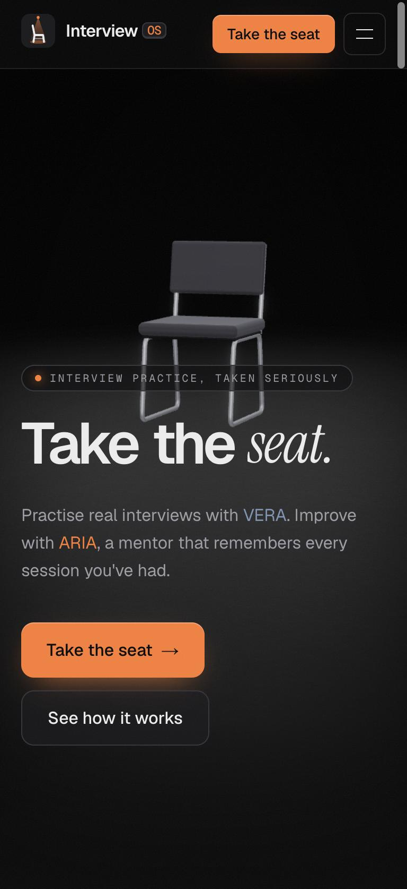
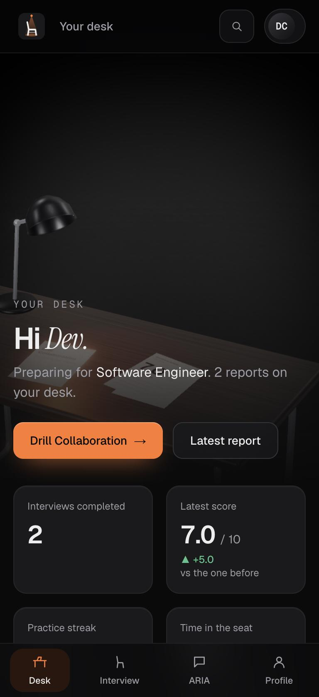
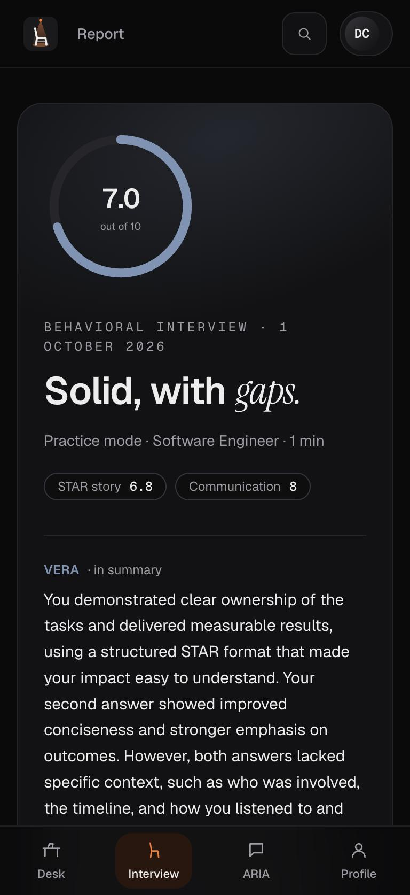
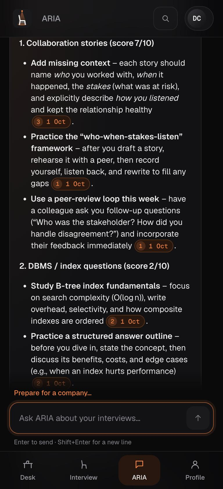
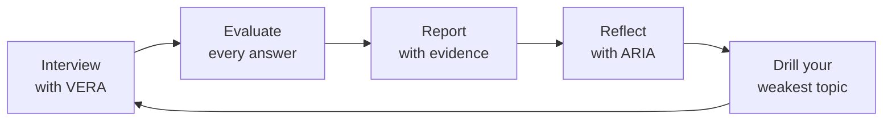
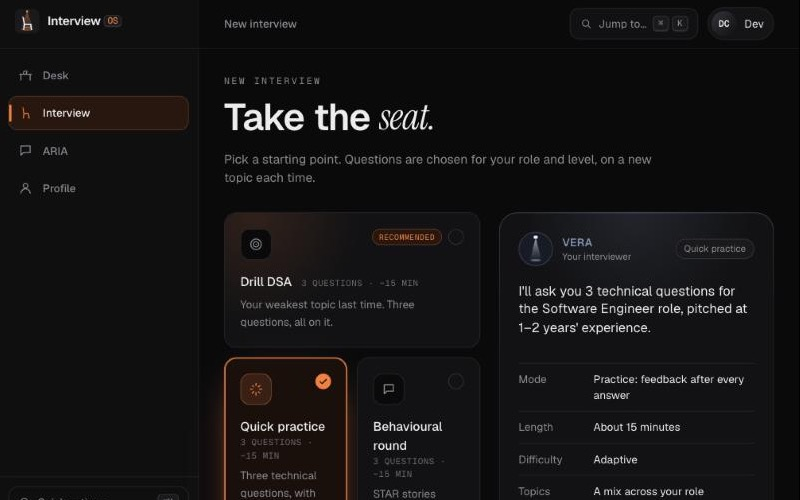
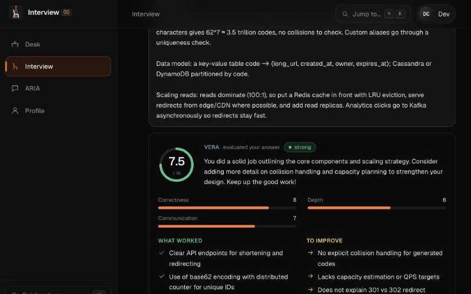
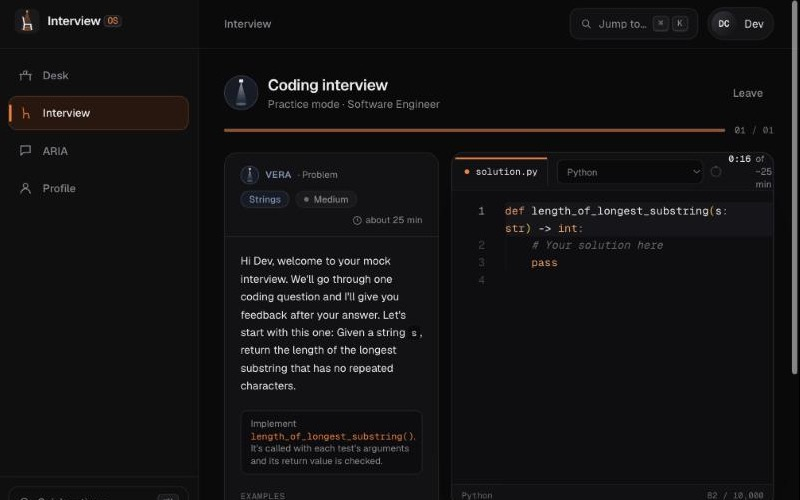

<div align="center">


# InterviewOS

**Take the seat.** Practise real interviews with **VERA**. Improve with **ARIA**,<br/>a mentor that remembers every session you've had.

<a href="https://interviewos-coach.vercel.app"></a>


<sub>The demo runs on free hosting: if it has been idle, the first load takes about a minute while the server wakes up.</sub>

</div>

<br/>

<table>
  <tr>
    <td align="center" width="25%"><br/><sub><b>The room.</b> Take the seat.</sub></td>
    <td align="center" width="25%"><br/><sub><b>Your desk.</b> Reports under the lamp.</sub></td>
    <td align="center" width="25%"><br/><sub><b>The report.</b> Honest, with evidence.</sub></td>
    <td align="center" width="25%"><br/><sub><b>ARIA.</b> Answers that cite your reports.</sub></td>
  </tr>
</table>

InterviewOS is an AI interview coach built as one continuous place: *the interview room*. You arrive at an empty chair under a spotlight, sit down for a live interview with VERA, get an honest report, and talk it through with ARIA at your desk. Every interview makes the next one better, because nothing you do is forgotten.



## Meet the two agents

| | Who | What they do |
|---|---|---|
| **VERA** | *Virtual Evaluator & Responsive Assessor*, the interviewer; the room's cool spotlight | Runs technical, behavioural (STAR) and live-coding interviews. Adapts difficulty to your answers, follows up when an answer is thin, gives one hint on request, and scores every answer on several dimensions. |
| **ARIA** | *Adaptive Reflection & Intelligent Assistance*, the mentor; the desk's warm lamp | Answers questions about your own interviews, citing the exact report. Explains where you lost marks, tracks progress, writes study plans, prepares you for a specific company, and sends you into drills. |

## What's on the site

| Page | What you get |
|---|---|
| **Landing** (`/`) | A 3D interview room (an empty chair under a spotlight) with a scroll-driven story of the loop, the two agents, interview types, a sample report and an FAQ. |
| **Sign in / Create account** | One card that morphs between sign-in and sign-up in the same room, no page reload. Signing in or out is a smooth camera move. |
| **Onboarding** | Four short steps: about you, target role and company (optional JD), skills, preferences. |
| **Your desk** (`/dashboard`) | Your reports lie on a 3D desk as printed sheets; the lamp lights your next step. Below: KPIs, score over time, where each topic stands, a 12-week practice calendar, Ask ARIA and every interview. |
| **Start an interview** | One-click presets (Quick practice, Behavioural round, Coding round, Full mock, *Drill your weakest topic*) or Customise everything. VERA sums up what's coming in her own words. |
| **The interview room** | One question at a time on a lit stage, arriving word by word; earlier rounds fold away. An answer box docked at the bottom (⌘/Ctrl + Enter), a timer ring, hints, and a score ring with feedback after each answer (practice mode). Serious mode is quieter: scores only at the end. |
| **The coding room** | Problem statement, a Monaco editor in the InterviewOS theme, Run examples / Submit (hidden tests too), your approach, and a console with pass/fail per test. Python is graded; JS, Java, C++ and C run as written. |
| **The report** | A story: the score and VERA's summary, how you scored (per question, topic and dimension), what went well, what to fix, your next steps, the full evidence, and finally the handoff: *VERA has passed your report to ARIA*. Printable / save as PDF. |
| **ARIA** (`/mentor`) | Chat grounded in your reports with citation chips (hover to see the source). Replies write themselves out, and drill and practice buttons appear under them. She answers general interview-prep questions as clearly labelled general advice, and politely declines anything off-topic (and attempts to jailbreak her). "Prepare me for Google" builds a week-by-week company plan. |
| **Everywhere** | ⌘K quick actions, a status line ("VERA ready · ARIA knows 3 reports · 4-day streak"), a phone tab bar, and skip links and full keyboard support. |
| **Admin** (`/admin`) | For `ADMIN_EMAILS` only: live errors and latency, tokens and cost per prompt version, and prompt A/B switching without a deploy. |

<table>
  <tr>
    <td align="center" width="33%"><br/><sub>Start an interview: presets and VERA's brief</sub></td>
    <td align="center" width="33%"><br/><sub>The interview room: VERA's evaluation</sub></td>
    <td align="center" width="33%"><br/><sub>The coding room: problem, editor, tests</sub></td>
  </tr>
</table>

**Design:** dark only, black and greys with sparing orange (the brand, ARIA's lamp) and steel (VERA's light). The 3D room is built entirely in code (no model files) with three.js. It meets WCAG 2.2 AA (checked with axe on every page), respects reduced motion, and falls back to a still image without WebGL.

## Tech stack

| Layer | Built with |
|---|---|
| Frontend | Next.js 16 (App Router), React 19, Tailwind CSS 4, Zustand, Motion, Lenis |
| 3D | three.js + React Three Fiber + postprocessing (bloom, filmic tone mapping) |
| Backend | FastAPI (REST + WebSockets), Pydantic, PyMongo async |
| Database | MongoDB (Azure Cosmos DB for MongoDB or Atlas in production; an in-memory double locally) |
| AI | Groq `openai/gpt-oss-120b` (VERA, reports, ARIA) and `gpt-oss-20b` (evaluation), all through one AI Gateway with token budgets and cost tracking |
| ARIA's memory | `rag_tool`: Chroma + Hugging Face `all-MiniLM-L6-v2` embeddings, intent-routed retrieval with citations |
| Code runner | [Piston](https://github.com/engineer-man/piston), self-hosted and optional (sandboxed, separate from the app) |
| Quality | 575 backend tests, AI eval suites (evaluator, interviewer, questions, 26 ARIA cases incl. jailbreaks), CI on every push |

```
 Browser (Next.js) ──REST──▶ FastAPI ──▶ MongoDB
        │                      │  ├──▶ AI Gateway ──▶ Groq (LLMs) · Hugging Face (embeddings)
        └──WebSocket (live ────┘  ├──▶ ARIA (rag_tool + Chroma on disk)
           interview)             └──▶ Piston (your own code runner, optional)
```

## Run it locally

No Docker or cloud account needed. You need Python 3.12 and Node 22. Two terminals:

```bash
cd backend
python3 -m venv .venv && source .venv/bin/activate
pip install -r requirements.txt
APP_ENV=local USE_INMEMORY_DB=true uvicorn app.main:app --reload --port 8000
```

```bash
cd frontend
npm install
npm run dev
```

Open http://localhost:3000 and create an account, or sign in as the auto-seeded local dev user **dev@example.com / dev-password-123** (this user only exists when `APP_ENV=local`). API docs: http://localhost:8000/docs (local only).

That's enough to click through every screen: without keys the backend uses a scripted fake AI. `USE_INMEMORY_DB=true` needs no database, but all data resets when the backend restarts.

### Settings and keys (`.env`)

Copy the example and fill in what you need. [`.env.example`](.env.example) explains every setting.

```bash
cp .env.example .env
```

| For | Set | Where to get it |
|---|---|---|
| Real interviews, reports and ARIA's replies | `GROQ_API_KEY` | Free tier: https://console.groq.com/keys |
| ARIA's search over your reports | `HF_TOKEN` (a "Read" token) | Free: https://huggingface.co/settings/tokens |
| Coding interviews | `PISTON_URL` | Your own Piston (below). Leave it empty and coding is hidden. |
| A real database | `COSMOS_CONNECTION_STRING` (and `USE_INMEMORY_DB=false`) | Any MongoDB, e.g. `docker compose up --build` |

`.env` is gitignored, so your keys stay on your PC. Never commit it. The frontend has one public setting, `NEXT_PUBLIC_API_URL`, in `frontend/.env.example`; `NEXT_PUBLIC_*` values end up in the browser, so they must never be secrets.

### Coding interviews: run your own code runner (optional)

Candidates' code runs on [Piston](https://github.com/engineer-man/piston), a sandboxed runner you host yourself. The project doesn't ship or share one. With Docker (Linux, or Docker Desktop on macOS/Windows):

```bash
docker run --privileged -d -p 2000:2000 -v piston-data:/piston --name piston ghcr.io/engineer-man/piston
```
```bash
curl -X POST http://localhost:2000/api/v2/packages -H "Content-Type: application/json" -d '{"language":"python","version":"3.12.0"}'
```

Then set `PISTON_URL=http://localhost:2000/api/v2` in `.env` and restart the backend. Python is graded against every test. Optionally install `node`, `java` and `gcc` the same way (`curl http://localhost:2000/api/v2/packages` lists what's available); those languages run as written but aren't graded. Don't expose Piston to the internet without a firewall or an API-key proxy.

**With a real MongoDB:** `docker compose up --build`, then `docker compose exec backend python -m scripts.seed --dev-user`.

## Tests and checks

```bash
cd backend && pytest -q                            # 575 unit + integration tests; no keys needed
cd backend && python -m scripts.seed --check       # validate the question bank and company seed data
cd frontend && npm run lint && npm run build       # lint + production build
cd backend && .venv/bin/python ../evaluation/interview_eval/run_evaluator_eval.py   # evaluator accuracy (live Groq)
```

CI runs the first three on every push and pull request ([.github/workflows/ci.yml](.github/workflows/ci.yml)).

## Deploy

The live demo runs on **Vercel** (frontend) + **Render** (backend, free plan, Singapore) + **MongoDB Atlas** (free cluster). **[docs/deployment.md](docs/deployment.md)** has step-by-step guides for that and two other setups:

| Path | What it is | Good for |
|---|---|---|
| **One VPS with Docker** | Everything, including Piston, on a single Linux server behind Caddy (automatic HTTPS). Any provider: Hetzner, DigitalOcean, Lightsail, Oracle Cloud free tier… | Cheapest full setup, coding included |
| **Vercel + Render + MongoDB Atlas** | Managed hosting with free/cheap tiers; Piston on a small VM of your own | Quickest public demo |
| **Azure** | App Service + Cosmos DB + Key Vault | Teams already on Azure |

All paths need the same things: one backend instance with a persistent disk (for ARIA's index) and WebSockets enabled, MongoDB, HTTPS on both sides, secrets in the host's environment, and `APP_ENV=prod`.

## Project structure

```
backend/     FastAPI: api/ (REST + WebSocket), core/ (interviews, evaluation, coding, ARIA, auth),
             agents/ (VERA, company prep), gateway/ (all AI calls), db/, utils/; tests/, scripts/
frontend/    Next.js: app/ (pages), components/ (three/, landing/, interview/, coding/, report/, mentor/, ui/ …),
             lib/ (API client, socket), store/ (state)
prompts/     Versioned prompts for VERA, the evaluators, reports, ARIA and company prep
data/seed/   Question bank (incl. 18 coding problems with hidden tests) and 10 curated companies
evaluation/  AI quality evals and their datasets
docs/        Architecture, flows, deployment, project structure, module guides
deploy/vps/  One-server production setup (Docker Compose + Caddy for HTTPS)
```

What every file does: **[docs/project-structure.md](docs/project-structure.md)**.

## Security and privacy

- **Auth:** bcrypt passwords; 30-minute JWT access tokens kept **in memory only** (never in browser storage); rotating refresh tokens in an httpOnly, Secure cookie with reuse detection, which silently restore your session after a reload. Tabs stay in sync over a BroadcastChannel.
- **Limits:** rate limits on login, sign-up, ARIA, interviews, code runs and company prep, plus a daily AI token cap per user.
- **Every AI call goes through one gateway** that records tokens, cost and errors. Prompts and answers are not stored unless `LLM_TRACE_CONTENT=true`.
- **ARIA's isolation:** she only ever reads the signed-in user's own reports.
- **Code:** it runs in your own Piston sandbox, never on the app server.
- **Production mode:** API docs are off, errors never include stack traces, the frontend sends security headers, and Docker images run as non-root and exclude `.env`.

## Documentation

| Doc | What it covers |
|---|---|
| [docs/architecture.md](docs/architecture.md) | Components, database schema, AI Gateway, the REST/WebSocket contract |
| [docs/flow.md](docs/flow.md) | User journeys and the interview state machine |
| [docs/deployment.md](docs/deployment.md) | Deploying: VPS with Docker, Vercel + Render + Atlas, or Azure |
| [docs/project-structure.md](docs/project-structure.md) | What every folder and file does |
| [docs/modules/rag-tool/INTEGRATION.md](docs/modules/rag-tool/INTEGRATION.md) | The RAG module behind ARIA's memory |

## Status and roadmap

**Built:**
- Phase 0: foundations
- Phase 1: the interview engine with VERA
- Phase 2: ARIA
- Phase 3: company preparation
- Phase 4: coding interviews
- Phase 6: observability, AI evals and cost
- Phase 7: the InterviewOS design, 3D room and accessibility pass

**Next:**
- Voice interviews (Phase 5)
- Email verification and password reset
- A full Content-Security-Policy and a custom domain (so Safari keeps sessions across the two hosts)
- Running more than one backend instance: shared rate limits and a hosted vector store
