# AI Interview Coach — System Architecture

> **Derived from**: `implementation_plan.md` and `flow.md`
> **Purpose**: Defines the complete technical architecture of the platform — component structure, data models, service boundaries, Azure service mapping, and inter-component contracts. All implementation work should be consistent with the structures defined here.

---

## Table of Contents

1. [System Overview](#1-system-overview)
2. [High-Level Architecture Diagram](#2-high-level-architecture-diagram)
3. [Frontend Architecture](#3-frontend-architecture)
4. [Backend Architecture](#4-backend-architecture)
5. [Database Architecture — Cosmos DB Schema](#5-database-architecture--cosmos-db-schema)
6. [Azure Service Architecture](#6-azure-service-architecture)
7. [AI Gateway Architecture](#7-ai-gateway-architecture)
8. [Interview Engine Architecture](#8-interview-engine-architecture)
9. [Agent Architecture](#9-agent-architecture)
10. [Live Coding Sandbox Architecture](#10-live-coding-sandbox-architecture)
11. [Voice Architecture](#11-voice-architecture)
12. [Security Architecture](#12-security-architecture)
13. [API Contract Overview](#13-api-contract-overview)
14. [Component Dependency Graph](#14-component-dependency-graph)

---

## 1. System Overview

### What the System Is

The AI Interview Coach is a full-stack AI platform composed of four distinct layers that must work in concert:

| Layer | Role | Technology |
|---|---|---|
| **Presentation** | User interface, real-time communication | Next.js + JavaScript + Tailwind CSS |
| **Application** | Business logic, state management, API | Python + FastAPI + Pydantic |
| **Intelligence** | LLM, agents, evaluation, voice, code execution | Groq (every LLM call: interviewer, evaluators, reports, Mentor) + Hugging Face (embeddings) + Azure AI Speech + Piston (self-hosted on Azure VM) |
| **Data** | Persistence, search, file storage | Azure Cosmos DB + Chroma (Mentor RAG, via `rag_tool`; Azure AI Search later) + Azure AI Search (company/JD, Phase 3) + Azure Blob Storage |

### Core Architectural Principles (Non-Negotiable)

> [!IMPORTANT]
> These principles must be respected at every layer and in every component.

1. **LLM is a component, not the system** — state, rules, and workflow control belong to the application. The Interview Agent *proposes* actions; the engine validates every transition (§8.2).
2. **All AI and code-execution calls go through the AI Gateway** — no direct Azure, Groq, Chroma or Piston calls from agents or services
3. **State lives in Cosmos DB** — interview state must survive WebSocket drops and server restarts
4. **Interviewer and Evaluator are separate** — in Serious Mode, the Interviewer sees only performance tier signals, never numeric scores
5. **Voice is an adapter** — core interview engine is text-in/text-out; voice wraps it
6. **Candidate code runs only in sandboxes** — never on the application server
7. **Prompts are versioned assets** — stored in `prompts/`, referenced by ID in every LLM call

---

## 2. High-Level Architecture Diagram

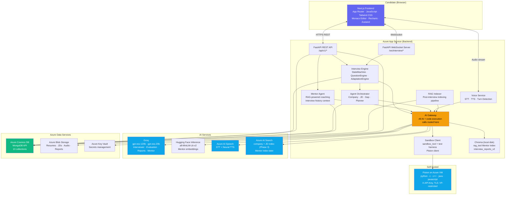

---

## 3. Frontend Architecture

### 3.1 Application Structure (Next.js App Router)

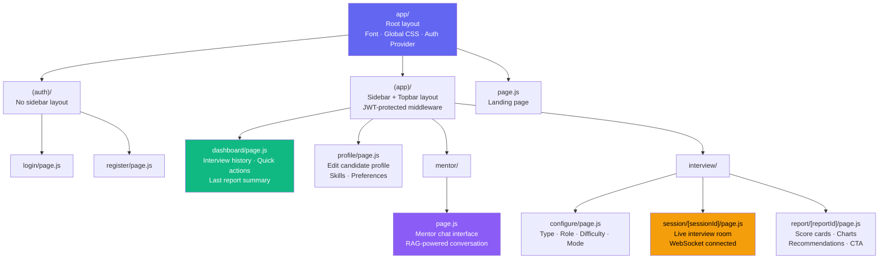

### 3.2 Component Tree

```
components/
│
├── ui/                          # Primitive, reusable components
│   ├── Button.jsx
│   ├── Input.jsx
│   ├── Card.jsx
│   ├── Badge.jsx
│   ├── Modal.jsx
│   ├── ProgressBar.jsx
│   ├── Tabs.jsx
│   ├── Select.jsx
│   └── Tooltip.jsx
│
├── layout/                      # Layout components
│   ├── Sidebar.jsx
│   ├── Topbar.jsx
│   └── PageWrapper.jsx
│
├── interview/                   # Interview-specific components
│   ├── QuestionDisplay.jsx      # Renders current question
│   ├── AnswerInput.jsx          # Text input for answers
│   ├── InterviewTimer.jsx       # Countdown/elapsed timer
│   ├── InterviewerAvatar.jsx    # AI interviewer visual
│   ├── EvaluationFeedback.jsx   # Practice mode feedback panel
│   ├── InterviewRoomLayout.jsx  # Serious mode clean layout
│   └── ModeSelector.jsx         # Practice / Serious toggle
│
├── coding/                      # Live coding components
│   ├── CodeEditor.jsx           # Monaco Editor wrapper
│   ├── LanguageSelector.jsx     # Python / JS / Java / C++ / C (Piston runtimes)
│   ├── OutputPanel.jsx          # stdout, stderr, per-test results (hidden tests: count only in serious mode)
│   ├── ProblemStatement.jsx     # Problem + examples display
│   └── CodingLayout.jsx         # Split-pane layout
│
├── mentor/                      # AI Mentor components
│   ├── MentorChat.jsx           # Main chat interface container
│   ├── ChatBubble.jsx           # Individual message (user or mentor)
│   ├── MentorInput.jsx          # Text input + send button
│   ├── MentorWelcome.jsx        # First-time / no-history state
│   ├── MentorSidebar.jsx        # Past conversation list
│   └── MentorAnswer.jsx         # Markdown reply + citation chips
│
├── voice/                       # Voice UI components
│   ├── MicrophoneButton.jsx     # Record start/stop
│   ├── WaveformVisualizer.jsx   # Real-time audio waveform
│   ├── RecordingIndicator.jsx   # Red dot recording indicator
│   └── ConsentModal.jsx         # Recording consent dialog
│
├── charts/                      # Data visualization
│   ├── ScoreRadar.jsx           # Multi-dimension radar chart
│   ├── TopicProgressBar.jsx     # Per-topic progress
│   ├── PerformanceTrend.jsx     # Historical performance line chart
│   └── DimensionBreakdown.jsx   # Score per dimension bar chart
│
└── report/                      # Report-specific components
    ├── ReportHeader.jsx          # Overall score + interview info
    ├── StrengthsPanel.jsx
    ├── WeakAreasPanel.jsx
    ├── RecommendationsPanel.jsx
    └── LoopCTA.jsx               # "Talk to Mentor" CTA
```

### 3.3 State Management (Zustand Stores)

```
store/
├── authStore.js         # { user, token, isAuthenticated, login(), logout() }
├── profileStore.js      # { profile, updateProfile() }
├── interviewStore.js    # { sessionId, sessionState, currentQuestion,
│                        #   messages, isConnected, connectWS(), sendAnswer() }
├── mentorStore.js       # { welcome, conversations, activeId, messages, sending,
│                        #   openConversation(), newConversation(), send() }
└── reportStore.js       # { reports, currentReport }
```

### 3.4 API Client Layer

All backend communication goes through a central `lib/api.js` module:

```javascript
// lib/api.js — structure
const api = {
  auth:      { register, login, refresh, logout },
  profile:   { get, update },
  mentor:    { sendMessage, getConversation, listConversations },
  interviews:{ create, getSession, getState, listSessions },
  questions: { listByTopic, listByRole },
  reports:   { get, list },
}
// All calls include Authorization: Bearer {token} header
// Auto-refresh token on 401 response
// Standardized error handling
```

---

## 4. Backend Architecture

### 4.1 Layered Architecture

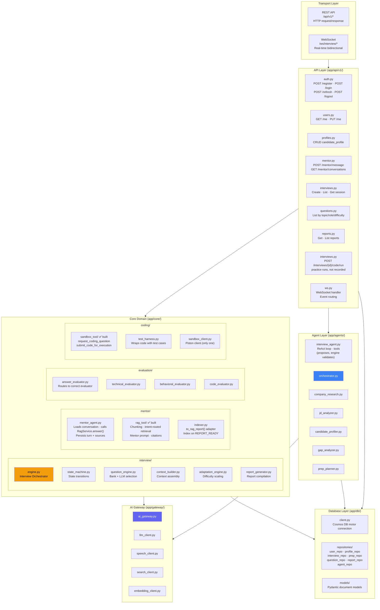

### 4.2 Dependency Injection (FastAPI)

```python
# app/dependencies.py — structure

async def get_db() -> AsyncIOMotorDatabase:
    """Yields Cosmos DB async motor connection"""

async def get_ai_gateway() -> AIGateway:
    """Yields singleton AI Gateway instance"""

async def get_current_user(token: str) -> User:
    """Validates JWT, returns current user"""

async def get_candidate_profile(user: User, db) -> CandidateProfile:
    """Fetches profile for current user"""
```

All route handlers receive dependencies via FastAPI's `Depends()`. This makes every component independently testable.

---

## 5. Database Architecture — Cosmos DB Schema

**Database**: Single Cosmos DB account, MongoDB API
**Consistency**: Session consistency (sufficient for this use case)
**Partitioning**: Most collections partitioned by `candidate_id`

### 5.1 Collection Overview

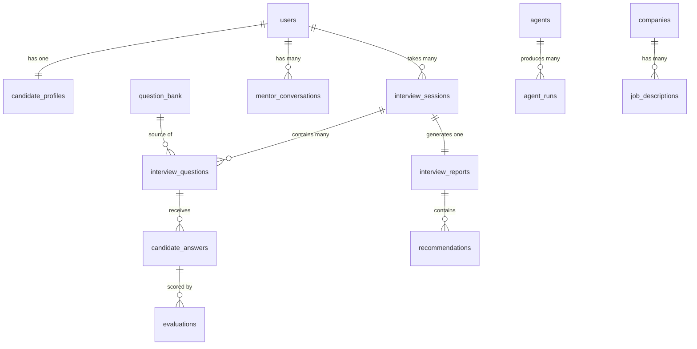

### 5.2 Collection Schemas

#### `users`
```json
{
  "_id": "ObjectId",
  "email": "string (unique, indexed)",
  "password_hash": "string (bcrypt)",
  "name": "string",
  "created_at": "datetime",
  "updated_at": "datetime",
  "is_active": "boolean",
  "last_login": "datetime"
}
```

#### `candidate_profiles`
```json
{
  "_id": "ObjectId",
  "candidate_id": "string (ref: users._id, indexed)",
  "personal": {
    "name": "string",
    "education": "string",
    "experience_level": "fresher | 1-2 | 3-5 | senior"
  },
  "target": {
    "role": "string",
    "company": "string | null",
    "job_description": "string | null"
  },
  "skills": ["string"],
  "preferences": {
    "input_mode": "text | voice",
    "output_mode": "text | voice",
    "preferred_difficulty": "easy | medium | hard | adaptive"
  },
  "preparation_scores": {
    "dsa": 0.0,
    "system_design": 0.0,
    "python": 0.0,
    "machine_learning": 0.0,
    "dbms": 0.0,
    "os": 0.0,
    "oops": 0.0,
    "behavioral": 0.0
  },
  "created_at": "datetime",
  "updated_at": "datetime"
}
```

#### `interview_sessions`
```json
{
  "_id": "ObjectId",
  "session_id": "string (UUID, indexed)",
  "candidate_id": "string (ref: users._id, indexed)",
  "config": {
    "interview_type": "technical | behavioral | coding",
    "role": "string",
    "experience_level": "string",
    "company": "string | null",
    "difficulty": "easy | medium | hard | adaptive",
    "input_mode": "text | voice",
    "output_mode": "text | voice",
    "interview_mode": "practice | serious",
    "role_key": "software_engineer | backend | fullstack | frontend | ml_engineer",   // derived from role
    "question_count": "number (1-5)"
  },
  "target_difficulty": "easy | medium | hard",   // resolved from config.difficulty; adaptation (1.8) moves it
  "state": "SETUP | INTRODUCTION | QUESTION | WAITING_FOR_RESPONSE | EVALUATING | FOLLOW_UP_DECISION | NEXT_TOPIC | INTERVIEW_COMPLETE | GENERATING_REPORT | REPORT_READY",
  "current_topic": "string",
  "topics_covered": ["string"],
  "questions_asked": "number",
  "performance_vector": {
    "dsa": 0.0,
    "system_design": 0.0,
    "behavioral": 0.0
  },
  "current_question_id": "string | null",
  "asked_question_ids": ["string"],
  "focus_topics": ["string"],             // set for a Weak-Area Drill; QuestionEngine restricts to these
  "current_coding_problem": {             // per-session, replaces sandbox_tool's global state
    "problem_id": "string",
    "language": "python | c | c++ | java | javascript",
    "draft_code": "string | null",        // debounced autosave, restored via SESSION_SNAPSHOT
    "started_at": "datetime"
  },
  "tokens_used": "number",                // AI Gateway budget accounting
  "interviewer_context": {
    "last_performance_tier": "strong | adequate | weak"
  },
  "started_at": "datetime",
  "completed_at": "datetime | null",
  "duration_seconds": "number | null",
  "report_id": "string | null"
}
```

#### `interview_questions`
```json
{
  "_id": "ObjectId",
  "question_id": "string (indexed)",
  "session_id": "string (ref: interview_sessions, indexed)",
  "candidate_id": "string (indexed)",
  "source": "bank | llm_generated",
  "bank_question_id": "string | null",
  "topic": "string",
  "subtopic": "string | null",
  "difficulty": "easy | medium | hard",
  "question_text": "string",
  "expected_concepts": ["string"],
  "evaluation_rubric": {
    "correctness": "string",
    "depth": "string",
    "communication": "string"
  },
  "is_follow_up": "boolean",
  "follow_up_to": "string | null",
  "asked_at": "datetime",
  "prompt_version_used": "string"
}
```

#### `candidate_answers`
```json
{
  "_id": "ObjectId",
  "answer_id": "string (indexed)",
  "session_id": "string (ref: interview_sessions, indexed)",
  "question_id": "string (ref: interview_questions)",
  "candidate_id": "string (indexed)",
  "answer_text": "string",
  "answer_type": "text | voice_transcribed | code",
  "code_submitted": "string | null",
  "code_language": "string | null",
  "code_execution_result": {
    "status": "accepted | wrong_answer | time_limit | runtime_error | compile_error | internal_error",
    "stdout": "string | null",
    "stderr": "string | null",
    "runtime_ms": "number | null",
    "passed_tests": "number | null",
    "total_tests": "number | null",
    "test_results": [{ "passed": "boolean", "is_hidden": "boolean", "input": "string | null", "expected": "string | null", "actual": "string | null" }]
  },
  "submitted_at": "datetime",
  "time_to_answer_seconds": "number"
}
```

#### `evaluations`
```json
{
  "_id": "ObjectId",
  "evaluation_id": "string (indexed)",
  "session_id": "string (indexed)",
  "question_id": "string",
  "answer_id": "string",
  "candidate_id": "string (indexed)",
  "evaluation_type": "technical | behavioral | coding",
  "dimensions": {
    "correctness": 0,
    "approach": 0,
    "communication": 0,
    "depth": 0,
    "edge_cases": 0,
    "complexity": 0,
    "situation": 0,
    "task": 0,
    "action": 0,
    "result": 0,
    "code_quality": 0,
    "specificity": 0
  },
  "overall_score": 0.0,
  "performance_tier": "strong | adequate | weak",
  "strengths": ["string"],
  "weaknesses": ["string"],
  "recommendations": ["string"],
  "model_answer_outline": ["string"],     // "a strong answer would cover…" (shown in practice mode + transcript replay)
  "raw_llm_response": "string",
  "prompt_version_used": "string",
  "model_used": "openai/gpt-oss-20b",
  "evaluated_at": "datetime",
  "latency_ms": "number"
}
```

#### `interview_reports`
```json
{
  "_id": "ObjectId",
  "report_id": "string (indexed)",
  "session_id": "string (unique, indexed)",
  "candidate_id": "string (indexed)",
  "scores": {
    "overall": 0.0,
    "technical": 0.0,
    "behavioral": 0.0,
    "coding": 0.0,
    "communication": 0.0,
    "problem_solving": 0.0,
    "confidence": 0.0
  },
  "per_topic_scores": {
    "dsa": 0.0,
    "system_design": 0.0,
    "behavioral": 0.0
  },
  "strong_areas": ["string"],
  "weak_areas": [
    {
      "topic": "string",
      "severity": "high | medium | low",
      "reason": "string"
    }
  ],
  "recommendations": [
    {
      "topic": "string",
      "priority": "high | medium | low",
      "action": "string"
    }
  ],
  "suggested_preparation_plan": {
    "priority_topics": ["string"],        // feeds the "Practice Weak Areas" drill link
    "estimated_days": "number",
    "steps": ["string"]                   // as built (1.10): the ordered study plan
  },
  "rag_chunk_ids": ["string"],            // set by indexer.py after rag_tool.index_report()
  "generated_at": "datetime",
  "prompt_version_used": "string"
}
```

**As built (1.10):**
- **Scores are always computed, never written by the model.** `scores` is `{overall, technical, communication}` for technical interviews and `{overall, story, communication}` for behavioral ones (story = the mean of the STAR, specificity and ownership dimensions). `coding` arrives in Phase 4.
- **Chart data (1.11):** `question_scores`, `dimension_scores` and `stats` are stored with the report.
- **The words** (`summary`, `strong_areas`, `weak_areas`, `recommendations`, and the plan's `estimated_days` / `steps`) come from Groq (`prompts/report/report_v1.txt`), given the evaluator's notes per answer rather than the answers. They are validated on merge:
  - topics must be ones covered (recommendations may also be `general`)
  - severity and priority come from the topic's real score
- `narrative_source` is `llm`, or `fallback` for the deterministic narrative stitched from the evaluator's notes; `prompt_version_used` records which.

#### `mentor_conversations`
```json
{
  "_id": "ObjectId",
  "conversation_id": "string (indexed)",
  "candidate_id": "string (indexed)",
  "title": "string",                   // the first question, trimmed to 60 chars
  "messages": [
    {
      "message_id": "string",
      "role": "user | assistant",
      "content": "string",
      "timestamp": "datetime",
      // assistant only:
      "retrieved_chunks": [{"citation": 1, "chunk_id": "…:summary", "session_id": "…", "report_id": "…", "date": "…", "topic": "…", "chunk_type": "summary"}],
      "actions": [{"type": "drill", "topics": ["dsa"], "role": "…", "interview_type": "technical", "href": "/interview/configure?focus=dsa&…"}],
      "intent": "vague | specific | comparison",
      "prompt_version": "mentor/mentor_v1",
      "latency_ms": 1500
    }
  ],
  "message_count": 4,                  // capped at 200; then 409 conversation_full
  "last_message_preview": "string",   // plain text, for the sidebar
  "created_at": "datetime",
  "updated_at": "datetime"
}
```
A turn (question + reply) is written in one update after the reply, so a failed LLM call never leaves a question without an answer, and a new conversation exists only once it has one. The Mentor sees the last 8 messages, with earlier `[n]` citations removed. A follow-up that finds no excerpts of its own reuses the `chunk_id`s of the last grounded reply.

#### `agent_runs`
```json
{
  "_id": "ObjectId",
  "run_id": "string (indexed)",
  "candidate_id": "string (indexed)",
  "agent_name": "company_research | jd_analyzer | candidate_profiler | gap_analyzer | prep_planner | orchestrator",
  "trigger": "string",
  "input": "object",
  "tool_calls": [
    {
      "tool": "string",
      "input": "object",
      "output": "object",
      "latency_ms": "number",
      "success": "boolean"
    }
  ],
  "output": "object",
  "success": "boolean",
  "error": "string | null",
  "total_latency_ms": "number",
  "tokens_used": "number",
  "started_at": "datetime",
  "completed_at": "datetime"
}
```

#### `companies` (knowledge cache)
```json
{
  "_id": "ObjectId",
  "company_id": "string (unique; slug of the name, e.g. goldman_sachs)",
  "name": "string",
  "aliases": ["string (indexed, lowercase)"],
  "overview": "string",
  "interview_process": [{"stage": "string", "description": "string"}],
  "technical_focus": ["topic key"],      // vocabulary: app/agents/prep/vocabulary.py
  "coding_focus": ["topic key"],
  "competencies": ["behavioral competency key"],
  "behavioral_values": ["string"],       // shown to candidates only when source = curated
  "tips": ["string"],
  "source": "curated | llm",             // curated: data/seed/companies/; llm: Groq, cached only if it knew the company
  "created_at": "datetime", "updated_at": "datetime"
}
```

#### `prep_plans` (Phase 3)
```json
{
  "plan_id": "string (unique)",
  "candidate_id": "string (indexed with created_at)",
  "company_name": "string", "company_id": "string | null",
  "company_source": "curated | cached | llm | unknown | failed",
  "jd_analysis": {"role_title": "…", "seniority": "…", "requirements": [{"area", "importance", "evidence"}], "other_skills": []},
  "analysis": {"gaps": [{"area", "kind", "importance", "status", "score", "priority", "reason"}], "strengths": [...]},
  "plan": {"summary": "…", "estimated_weeks": 3, "weeks": [{"week", "theme", "focus_areas", "activities", "mock_interview"}],
           "readiness_check": "…", "company_tips": []},
  "plan_source": "llm | fallback",
  "actions": [{"type": "practice", "href": "/interview/configure?…", "label": "Week 1: Coding · Arrays"}],
  "markdown": "the Mentor message", "run_id": "agent_runs id", "created_at": "datetime"
}
```

#### `question_bank`
```json
{
  "_id": "ObjectId",
  "question_id": "string (indexed)",
  "type": "technical | behavioral | coding",
  "topic": "string (indexed)",
  "subtopic": "string",
  "difficulty": "easy | medium | hard",
  "roles": ["software_engineer | ml_engineer | backend | frontend | fullstack"],
  "question_text": "string",
  "expected_concepts": ["string"],
  "evaluation_rubric": {
    "correctness": "string",
    "complexity": "string",
    "edge_cases": "string",
    "communication": "string"
  },
  "follow_up_possibilities": ["string"],
  "for_coding_interview": "boolean",
  "test_cases": [
    {
      "input": "string",
      "expected_output": "string",
      "is_hidden": "boolean"
    }
  ],
  "times_used": "number",
  "created_at": "datetime"
}
```

### 5.3 Index Strategy

| Collection | Indexed Fields |
|---|---|
| `users` | `email` (unique) |
| `candidate_profiles` | `candidate_id` |
| `interview_sessions` | `session_id`, `candidate_id`, `state` |
| `interview_questions` | `session_id`, `question_id` |
| `candidate_answers` | `session_id`, `question_id` |
| `evaluations` | `session_id`, `candidate_id` |
| `interview_reports` | `report_id`, `session_id`, `candidate_id` |
| `mentor_conversations` | `conversation_id` (unique), (`candidate_id`, `updated_at`) |
| `agent_runs` | `candidate_id`, `agent_name`, `started_at` |
| `question_bank` | `type`, `topic`, `difficulty`, `roles` (compound) |
| `companies` | `name` |

### 5.4 Mentor RAG Index (Chroma, via `rag_tool`)

Not a Cosmos collection. It's a **rebuildable** index derived from `interview_reports` + `evaluations` by `core/mentor/indexer.py`.

| Property | Value |
|---|---|
| Collection | `interview_reports_v2` (cosine distance), path `CHROMA_PATH` |
| Chunk IDs | `{session_id}:summary` · `{session_id}:question:{question_id}` · `{session_id}:recommendations`. They're deterministic, so re-indexing upserts |
| Metadata | `user_id` (= `candidate_id`), `session_id`, `date`, `interview_type`, `report_topic`, `chunk_type`, `topic`, `score`, `question_id` (question chunks) |
| Isolation | Every read filters `where={"user_id": …}` |
| Rebuild | Safe to delete and re-index from Cosmos at any time |
| Indexing | `ReportIndexer`, in the background once the report is sent; retried after 2 s, 10 s, 30 s; a sweep at startup and on each Mentor visit catches anything left (`rag_indexed: false`) |
| Embeddings | Through `AIGateway.embed()` (`GatewayEmbeddings`), so they're logged with the LLM calls |

Moving to Azure AI Search later keeps the same chunk IDs and metadata as index fields.

---

## 6. Azure Service Architecture

### 6.1 Service Map

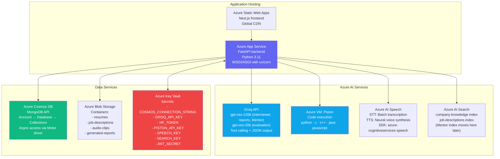

### 6.2 Azure Service Responsibility Matrix

| Service | What It Does | What It Does NOT Do |
|---|---|---|
| **Groq (gpt-oss-120b / gpt-oss-20b)** | Every LLM call: generate questions, evaluate answers, produce reports, run the Interview Agent's tool loop, Mentor answers, research companies, analyze JDs | Own interview state, make routing decisions, embeddings |
| **Hugging Face Inference** | Mentor embeddings (`all-MiniLM-L6-v2`, 384-dim) | Chat |
| **Chroma** | Mentor RAG index (rebuildable, §5.4) | Store canonical data |
| **Piston (Azure VM)** | Execute candidate code in python, c, c++, java, javascript with resource limits | Grade (the harness does that), store state |
| **Azure AI Speech (STT)** | Convert candidate voice audio to text transcript | Process meaning, evaluate content |
| **Azure AI Speech (TTS)** | Synthesize interviewer text responses into audio | Generate the text itself |
| **Azure AI Search** | Company knowledge and JD indexes (Phase 3); Mentor index later | Store structured application data |
| **Azure Cosmos DB** | Store all structured application data (users, sessions, evaluations, reports, mentor conversations) | Semantic search, AI inference |
| **Azure Blob Storage** | Store large binary files (resumes, audio, PDFs, report exports) | Index content, serve application data |
| **Azure Key Vault** | Securely store and rotate secrets, credentials, connection strings | Application logic |

### 6.3 Configuration & Secrets Flow

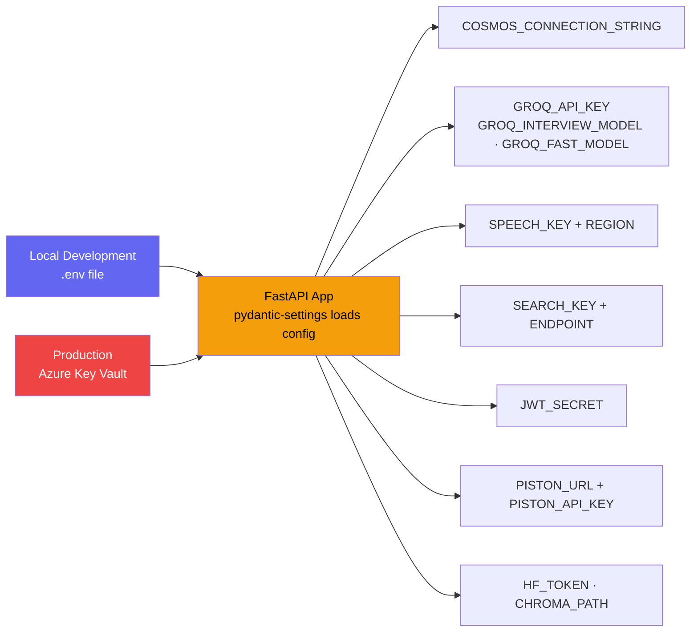

---

## 7. AI Gateway Architecture

The AI Gateway is the **single point of contact** for all AI service calls. Nothing calls Azure APIs directly.

### 7.1 Class Structure

```python
# app/gateway/ai_gateway.py — structure

class AIGateway:

    # LLM Methods (Groq: gpt-oss-120b by default, gpt-oss-20b for fast/high-volume call types)
    async def generate(prompt, context, temperature, max_tokens) -> str
    async def generate_structured(prompt, schema, context) -> dict
    async def generate_with_tools(messages, tools) -> ToolCall | FinalMessage   # Interview Agent ReAct loop
    async def stream(prompt, context) -> AsyncGenerator[str]

    # Embeddings (Mentor: HF all-MiniLM-L6-v2 via an EmbeddingProvider; gateway/embeddings.py)
    async def embed(text: str) -> list[float]
    # No search(): vector search stays in rag_tool (a local Chroma query that always filters on user_id).
    # Azure AI Search later replaces rag_tool's store and the embedding provider.

    # Speech
    async def transcribe(audio_bytes: bytes, language: str) -> str
    async def synthesize(text: str, voice: str) -> bytes

    # Code Execution (Piston via core/coding/sandbox_client.py; no other caller talks to Piston)
    async def execute_code(language: str, code: str, stdin: str) -> ExecutionResult

    # Budget
    def budget_remaining(session_id: str) -> int     # read by AdaptationEngine._should_wrap_up()

    # Internal helpers (private)
    async def _call_groq(messages, **kwargs) -> ChatCompletion
    async def _retry_with_backoff(func, max_retries=3) -> Any
    def _log_usage(model, tokens_used, latency_ms, call_type, session_id, candidate_id) -> None
    def _build_messages(prompt, context) -> list[dict]
```

### 7.2 Request Flow Through Gateway

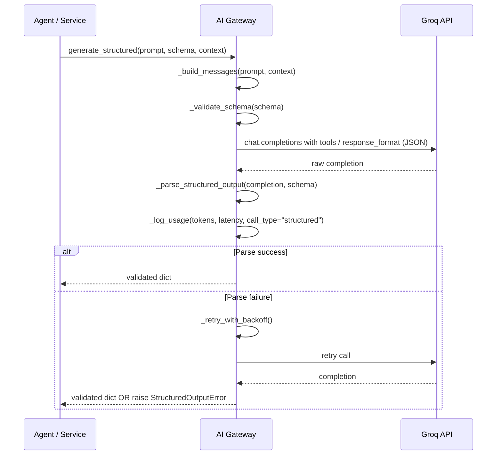

### 7.3 Prompt Version Tracking

Every call to the AI Gateway that uses a prompt must pass a `prompt_version`:

```python
await gateway.generate_structured(
    prompt=load_prompt("evaluator/technical_v1.txt"),
    prompt_version="evaluator/technical_v1",   # stored in DB alongside result
    schema=TechnicalEvaluationSchema,
    context=evaluation_context
)
```

This ensures every evaluation, question, and report stored in DB has a traceable prompt version ID.

---

## 8. Interview Engine Architecture

The Interview Engine is the central orchestrator of a live interview session.

### 8.1 Component Relationships

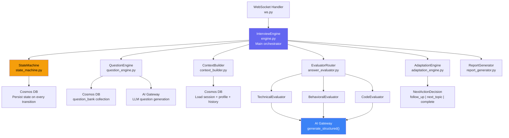

### 8.2 StateMachine

```python
# app/core/interview/state_machine.py — structure

class InterviewStateMachine:
    VALID_TRANSITIONS = {
        "SETUP":                 ["INTRODUCTION"],
        "INTRODUCTION":          ["QUESTION"],
        "QUESTION":              ["WAITING_FOR_RESPONSE"],
        "WAITING_FOR_RESPONSE":  ["EVALUATING"],
        "EVALUATING":            ["FOLLOW_UP_DECISION"],
        "FOLLOW_UP_DECISION":    ["QUESTION", "NEXT_TOPIC", "INTERVIEW_COMPLETE"],
        "NEXT_TOPIC":            ["QUESTION"],
        "INTERVIEW_COMPLETE":    ["GENERATING_REPORT"],
        "GENERATING_REPORT":     ["REPORT_READY"],
        "REPORT_READY":          [],
    }

    async def transition(session_id, new_state) -> InterviewSession:
        """Validates transition, updates Cosmos DB, returns updated session"""

    def can_transition(current_state, new_state) -> bool:
        """Pure function — testable without DB"""
```

**Who decides transitions.** The Interview Agent returns an `AgentDecision.action` (e.g. `deliver_follow_up`, `request_coding_challenge`, `wrap_up`). It never returns a state. The engine:

1. maps the action to a target state (`ACTION_TO_STATE`, a static table)
2. checks it with `can_transition()`. An invalid action is rejected and the agent is re-prompted once, then falls back to `AdaptationEngine.decide_next_action()`
3. applies the overrides: if `AdaptationEngine._should_wrap_up()` is true (question count, time limit or token budget), the target becomes `INTERVIEW_COMPLETE` whatever the agent proposed.

**As built (1.3)** — `app/core/interview/state_machine.py`:
- Two failure transitions are added to the table above: `EVALUATING → WAITING_FOR_RESPONSE` (evaluation failed or its worker died; the candidate resubmits) and `NEXT_TOPIC → INTERVIEW_COMPLETE` (no next question could be prepared; finish with the answers so far).
- `ACTION_TO_STATE`:
  - `deliver_question` → `NEXT_TOPIC`
  - `deliver_follow_up` → `QUESTION`
  - `request_coding_challenge` → `NEXT_TOPIC`
  - `wrap_up` → `INTERVIEW_COMPLETE`
  - `deliver_hint` and `deliver_feedback` cause no state change and are only valid in `WAITING_FOR_RESPONSE`.
- Every move is validated, then persisted with compare-and-set. `state_history` (capped at 100) records each state entered.
- **Reconnects and races.** States fall into three groups:
  - **SETTLED** (`WAITING_FOR_RESPONSE`, `REPORT_READY`): nothing to do.
  - **WORKING** (`EVALUATING`, `GENERATING_REPORT`): LLM work another worker may be doing. A connection waits, and takes over only when the session is older than `STALE_WORK_SECONDS` (default 120).
  - **DRIVEN** (the rest): the engine redoes the step. A connection that loses the compare-and-set waits until the session settles, then sends a fresh `SESSION_SNAPSHOT`.
  - Taking over a stale `EVALUATING` session sends `ERROR evaluation_interrupted` (retryable). Taking over `GENERATING_REPORT` reuses a report that was already saved.
- **Sends are best-effort.** A failed WebSocket send marks the socket closed and never interrupts the engine, so a turn always completes in the database.

The coding sub-flow needs no extra states (as built, Phase 4): a coding problem is a question with `type: coding` whose asked-question document keeps its `coding` spec and every test. Thinking, coding and Run all happen in `WAITING_FOR_RESPONSE` (Run is a REST call that changes nothing); `CODE_SUBMIT` moves it to `EVALUATING`, where the server runs every test, sends `CODE_RESULT`, and the coding evaluator scores it; then `FOLLOW_UP_DECISION` as usual. A follow-up on a coding problem is a text question. The editor's draft is `interview_sessions.code_draft`. The interview also wraps up after `MAX_INTERVIEW_MINUTES` (default 60), decided by the state machine, whatever the question count.

### 8.3 QuestionEngine

```python
# app/core/interview/question_engine.py — structure

class QuestionEngine:

    async def select_next_question(session: InterviewSession, profile: CandidateProfile) -> Question:
        """
        Selection priority:
        1. Check if follow-up is needed (from last AdaptationEngine decision)
        2. Find matching question in bank (topic, difficulty, role, not in asked_ids;
           restricted to session.focus_topics for a Weak-Area Drill)
        3. If no bank match → LLM generate question via AI Gateway
        4. Return selected/generated question
        """

    async def generate_question(topic, difficulty, role, context) -> Question:
        """LLM-generated question as fallback"""

    def _calculate_target_difficulty(performance_vector, config) -> str:
        """Pure function — maps performance to difficulty level"""
```

### 8.4 AdaptationEngine

```python
# app/core/interview/adaptation_engine.py — structure

class AdaptationEngine:

    def decide_next_action(evaluation: EvaluationResult, session: InterviewSession) -> NextAction:
        """
        Pure function — deterministic, fully unit-testable.

        Returns NextAction:
        - action: "follow_up" | "next_topic" | "complete"
        - difficulty_delta: +1 | 0 | -1
        - suggested_topic: str | None
        - reason: str
        """

    def _compute_performance_tier(score: float) -> str:
        """strong (>=7.5) | adequate (5.0-7.4) | weak (<5.0)"""

    def _should_wrap_up(session: InterviewSession, budget_remaining: int) -> bool:
        """Check time limit, question count and token budget (gateway.budget_remaining)"""
```

**As built (1.8)** — `app/core/interview/adaptation_engine.py`, pure functions:
- `decide_next_action(evaluation, question, session, *, budget_remaining, token_reserve, follow_ups_enabled)` → `NextAction(action, difficulty_delta, target_difficulty, suggested_topic, reason, follow_up_text)`. It checks, in order:
  1. token budget → `complete`
  2. adequate answer to a main question with a follow-up available → `follow_up` (at most one per question)
  3. question count reached → `complete`
  4. otherwise `next_topic`
- **Difficulty:** strong → +1 and weak → −1, only when `config.difficulty == "adaptive"`, bounded at easy and hard.
- `update_performance()` maintains `performance_vector` as `{topic: {mean, n}}`. `weakest_focus_topic()` brings a drill's weakest topic back once every focus topic has been covered.
- `NextAction.agent_action` maps to the state machine's vocabulary (`deliver_follow_up` / `deliver_question` / `wrap_up`), so the engine validates it with `next_state_for_action()`, the same check the interviewer agent's proposals will go through in 1.6.
- A bank that has no question at the target difficulty counts as a miss: `QuestionEngine` generates one at that level and falls back to the closest bank level if generation fails.

### 8.5 ContextBuilder

The ContextBuilder controls **exactly what context each LLM call receives**. This is critical for prompt efficiency and output consistency.

```python
# app/core/interview/context_builder.py — structure

class ContextBuilder:

    def build_interviewer_context(session, profile, question) -> InterviewerContext:
        """
        Returns:
        - candidate: name, role, experience_level
        - question: text, topic, difficulty
        - conversation_history: last N Q&A pairs (capped)
        - interview_mode: practice | serious
        - performance_tier: strong | adequate | weak (serious only, no scores)
        - current_topic, interview_type
        NOTE: Never includes raw evaluation scores in serious mode
        """

    def build_evaluator_context(session, profile, question, answer) -> EvaluatorContext:
        """
        Returns:
        - question: full question + rubric + expected_concepts
        - answer: candidate's answer text
        - candidate: role, experience_level
        - interview_type
        NOTE: Never includes previous evaluation scores (prevents anchoring bias)
        """

    # As built (1.6): app/core/interview/context_builder.py — evaluation_summary() (tier + strengths +
    # weaknesses, no numbers), performance_summary() (per-topic tiers from performance_vector), and
    # recommendation_text() (the AdaptationEngine's suggestion without its score-bearing reason).

    def build_agent_context(profile, additional_data) -> AgentContext:
        """Context for preparation and company agents"""
```

---

## 9. Agent Architecture

### 9.1 Agent Design Pattern

Every agent follows the same pattern:

```python
# Pattern for all agents
class CompanyResearchAgent:

    def __init__(self, gateway: AIGateway, db: Database):
        self.gateway = gateway
        self.db = db
        self.tools = [search_company, search_web]  # tool functions

    async def run(self, input: AgentInput) -> AgentOutput:
        """
        1. Log agent_run start in DB
        2. Execute tool calls (logged individually)
        3. Call AI Gateway for reasoning/synthesis
        4. Validate output with Pydantic
        5. Log agent_run completion with full trace
        6. Return typed output
        """
```

### 9.2 Tool Layer

```python
# All agent tools — pure async functions

async def search_company(name: str, gateway: AIGateway) -> list[Document]:
    """Azure AI Search → company-knowledge index"""

async def search_web(query: str, gateway: AIGateway) -> list[str]:
    """Optional web search via Bing Search API or similar"""

async def extract_requirements(jd_text: str, gateway: AIGateway) -> JDRequirements:
    """LLM structured extraction of role, skills, experience, areas"""

async def get_candidate_profile(candidate_id: str, db) -> CandidateProfile:
    """Cosmos DB retrieval"""

async def get_interview_history(candidate_id: str, query: str, rag: RagService) -> list[dict]:
    """Relevant past-performance chunks via rag_tool (same index the Mentor uses)"""

async def update_progress(candidate_id: str, topic: str, score: float, db) -> None:
    """Update candidate_profiles.preparation_scores[topic] (running average)"""

async def generate_report(session_id: str, gateway: AIGateway, db) -> InterviewReport:
    """Aggregate evaluations + LLM report generation"""
```

### 9.3 Orchestrator Flow

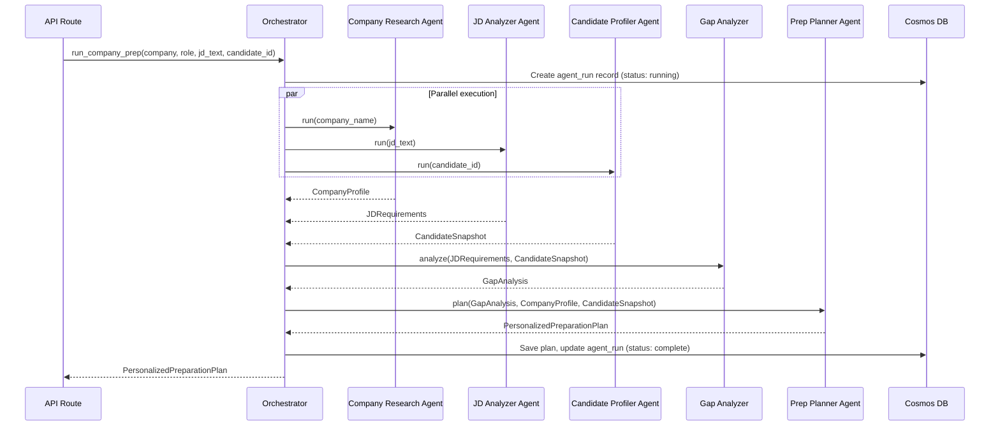

---

## 10. Live Coding Sandbox Architecture

> **As built (Phase 4):** the fixes from `plan-review.md` §C are in `app/core/coding/`: `languages.py` (Piston runtimes; Python graded), `sandbox_client.py` (`PistonExecutor`, the only Piston caller, behind `AIGateway.execute_code()`), `test_harness.py` (graded Python runner). Problems live in `question_bank` (18, seeded from `data/seed/question_bank/coding.json`); coding problems are never LLM-generated because their tests must be verified. The old `sandbox_tool/` (local only, gitignored) is superseded and can be deleted.
>
> The harness appends a runner that calls the candidate's function on every test input (hidden ones too) and prints each **return value** on a line tagged with a random marker. **Expected outputs never enter the sandbox**: comparison happens on the server (Python literals, list order ignored where the problem allows), so printing fake results or reading the program's source can't pass a test. Correctness = the share of tests passed; the evaluator's other six dimensions come from Groq, and the overall score is a fixed weighting (`code_evaluator.WEIGHTS`).

### 10.1 Components

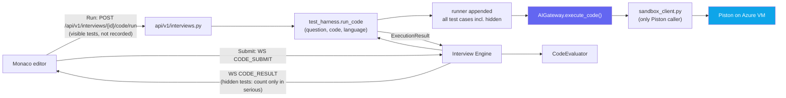

The browser never reports an execution result; the server always executes the code itself.

### 10.2 Sandbox Client (Piston)

```python
# app/core/coding/sandbox_client.py — structure

PISTON_RUNTIMES = {                      # language -> (piston language, version, filename)
    "python":     ("python",     "3.12.0",  "main.py"),
    "c":          ("c",          "10.2.0",  "main.c"),
    "cpp":        ("c++",        "10.2.0",  "main.cpp"),
    "java":       ("java",       "15.0.2",  "Main.java"),
    "javascript": ("javascript", "20.11.1", "main.js"),
}

class SandboxClient:
    def __init__(self, base_url: str, api_key: str): ...   # from config.py, never load_dotenv

    async def execute(self, language: str, code: str, stdin: str = "") -> RawExecution:
        """POST {base_url}/execute with X-API-Key.
        Rejects unsupported languages and code > 10,000 chars before sending.
        30s timeout -> status time_limit; network error -> internal_error.
        Never includes the API key in errors or logs."""
```

### 10.3 Test Harness

```python
# app/core/coding/test_harness.py — structure

def wrap(problem: CodingProblem, code: str, language: str) -> str:
    """Returns a runnable program: the candidate code + a runner that calls the
    problem's entry function for every test case (visible + hidden) and prints
    one JSON line per test. Python first; other languages raise NotSupported
    and fall back to run-only (stdout, no grading)."""

def parse(raw: RawExecution, problem: CodingProblem) -> ExecutionResult:
    """Maps Piston output + per-test JSON lines to ExecutionResult."""
```

The candidate can't make a submission pass by deleting asserts: grading only looks at the harness's per-test output, not the exit code.

### 10.4 Execution Result Schema

```python
ExecutionStatus = Literal["accepted", "wrong_answer", "time_limit",
                          "runtime_error", "compile_error", "internal_error"]

class TestCaseResult(BaseModel):
    passed: bool
    is_hidden: bool
    input: str | None        # None for hidden tests when sent to the client in serious mode
    expected: str | None
    actual: str | None

class ExecutionResult(BaseModel):
    status: ExecutionStatus
    stdout: str | None
    stderr: str | None
    compile_output: str | None
    runtime_ms: int | None
    memory_kb: int | None
    passed_tests: int
    total_tests: int
    test_results: list[TestCaseResult]
```

---

## 11. Voice Architecture

Voice is implemented as an **adapter** — the core interview engine receives and returns text only.

### 11.1 Voice Adapter Layer

```python
# app/voice/ — structure

class STTClient:
    """Speech-to-Text using Azure AI Speech SDK"""
    async def transcribe_batch(audio_bytes: bytes, language: str = "en-US") -> str:
        """Batch transcription — Phase 5 MVP"""

    async def transcribe_stream(audio_stream: AsyncGenerator) -> AsyncGenerator[str]:
        """Streaming transcription — Phase 5+ upgrade"""

class TTSClient:
    """Text-to-Speech using Azure AI Speech SDK"""
    async def synthesize(text: str, voice: str = "en-US-AriaNeural") -> bytes:
        """Full synthesis — batch mode"""

    async def synthesize_stream(text: str) -> AsyncGenerator[bytes]:
        """Streaming synthesis — Phase 5+ upgrade"""

class TurnDetector:
    """Voice Activity Detection"""
    def detect_end_of_turn(audio_buffer: bytes, silence_threshold_ms: int = 1500) -> bool:
        """Returns True when candidate has finished speaking"""
```

### 11.2 Voice WebSocket Extension

The existing interview WebSocket is extended with binary frame support for audio:

| Message Type | Direction | Payload |
|---|---|---|
| `AUDIO_CHUNK` | Client → Server | Binary audio bytes (16kHz, 16-bit PCM) |
| `AUDIO_END` | Client → Server | Signal end of speech |
| `TRANSCRIPT` | Server → Client | Text transcript of candidate speech |
| `AI_RESPONSE_AUDIO` | Server → Client | Binary TTS audio |
| `VOICE_ERROR` | Server → Client | STT/TTS failure with fallback instruction |

---

## 12. Security Architecture

### 12.1 Authentication Flow

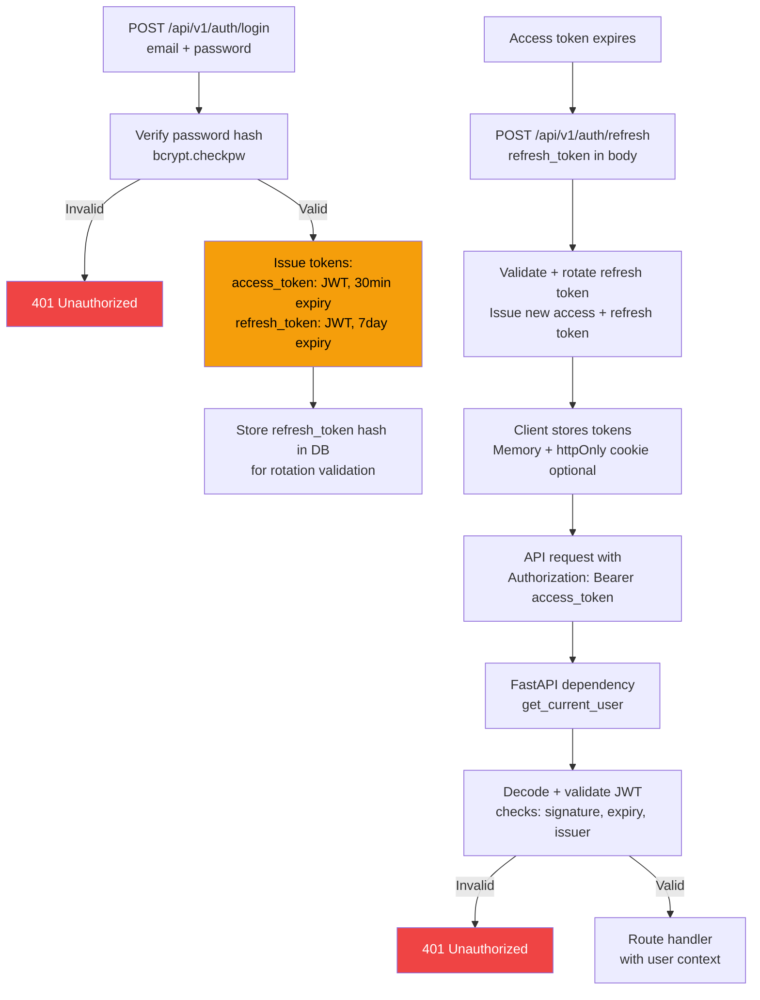

### 12.2 Data Boundary Rules

| Data | Stored Where | Exposed To Frontend |
|---|---|---|
| Password | Cosmos DB (bcrypt hash only) | Never |
| JWT secret | Azure Key Vault | Never |
| Azure API keys | Azure Key Vault | Never |
| Raw evaluation scores | Cosmos DB | Only in Practice Mode or after interview ends |
| Candidate answers | Cosmos DB | Yes (own answers only) |
| Voice recordings | Optional: Azure Blob | Only with explicit consent |
| Interview transcripts | Cosmos DB | Yes (own sessions only) |

### 12.3 Input Validation Rules

- All request bodies validated by **Pydantic v2 models** before any business logic runs
- Code submissions: **maximum 10,000 characters** — validated before forwarding to sandbox
- JD text input: **maximum 50,000 characters**
- Answer text: **maximum 5,000 characters**
- Rate limiting (as built, in-process: `utils/rate_limit.py`): failed logins per email and per IP (`LOGIN_FAILURES_PER_15_MIN`), sign-ups per IP, Mentor messages and interview starts per candidate (each is LLM spend), Run per candidate; WebSocket messages per connection. 429 `rate_limited`. A shared store (Redis / API Management) replaces it when there are several workers
- Request bodies over `MAX_REQUEST_BYTES` (1 MB) are refused with 413 before they're read
- Candidate code is **never executed on the application server** — always routed to Piston
- **Execution results are never accepted from the client.** Only `CODE_SUBMIT` (code + language) is accepted; the server executes and grades.
- Hidden test inputs and outputs never leave the server in Serious mode
- Mentor `user_id` is always taken from the JWT, never from the request body

### 12.3a Security audit (2026-09-29, after Phase 4)

What was checked, and what changed:

| Area | Result |
|---|---|
| Secrets in git history and the working tree | Clean: no API key, token, connection string or VM address was ever committed; `.env` is ignored (now `chmod 600`) |
| Dependencies | `npm audit`: 0. `pip-audit`: 5 advisories, all `chromadb`, all in Chroma's **server** HTTP API; the app embeds Chroma in-process and runs no Chroma server, so none apply (recheck when a fixed version ships). Chroma's telemetry `capture()` is a no-op in 1.5.9 |
| Tokens | HS256 pinned, issuer/expiry/jti required, access vs refresh type checked, refresh rotation with reuse detection, role read from the database. **Fixed:** local mode used a secret written in the repo, so a deployment that forgot `APP_ENV` would have accepted forged tokens; local now generates a random secret per process |
| Access control | Every data endpoint needs a token; every ID-taking endpoint and the WebSocket check ownership (404 otherwise). One test tries all of them as a second user |
| Abuse | **Added** the rate limits and body-size limit above; API docs (`/docs`, `/openapi.json`) are served only in local/test |
| Input | Pydantic on every body, validation errors never echo values back, profile skills capped at 60 chars each |
| Code execution | Only on Piston; expected outputs never enter the sandbox; forged result lines score 0 (checked on the real VM) |
| Frontend | No raw HTML (react-markdown with its URL sanitising), safe post-login redirects, external links `noopener`. **Added** headers: `X-Frame-Options: DENY`, `frame-ancestors 'none'`, `nosniff`, `Referrer-Policy`, `Permissions-Policy`; `X-Powered-By` removed. A full CSP (nonces, self-hosted Monaco) is Phase 6/7 |
| Logs | No emails, passwords, tokens or answers logged |
| Infra | `docker-compose` ports bound to 127.0.0.1 (MongoDB has no password); `.dockerignore` excludes local-only files; CI `permissions: contents: read`; backend image runs `--proxy-headers` (trusted proxies via `FORWARDED_ALLOW_IPS`) |

Known and accepted for now: tokens in `localStorage` (§12.1 trade-off; moving the refresh token to an httpOnly cookie is Phase 6), registration says when an email is already registered, refresh-token rows aren't expired from the database (Cosmos TTL works only on `_ts`), limits are per process.

### 12.4 Piston VM

- Plain HTTP + `X-API-Key` today. Put TLS in front of it, **or** restrict the VM's network security group to the App Service outbound IPs.
- `PISTON_API_KEY` lives in Key Vault / `.env` only; never in frontend code, logs or error messages.
- Resource limits are enforced by Piston's per-runtime config (CPU time, memory, output size).

---

## 13. API Contract Overview

### REST Endpoints

| Method | Path | Auth | Description |
|---|---|---|---|
| `POST` | `/api/v1/auth/register` | ❌ | Register new user |
| `POST` | `/api/v1/auth/login` | ❌ | Login, get JWT tokens |
| `POST` | `/api/v1/auth/refresh` | ❌ | Refresh access token |
| `GET` | `/api/v1/users/me` | ✅ | Get current user |
| `GET` | `/api/v1/profiles/me` | ✅ | Get candidate profile |
| `POST` | `/api/v1/profiles` | ✅ | Create candidate profile |
| `PUT` | `/api/v1/profiles/me` | ✅ | Update candidate profile |
| `POST` | `/api/v1/mentor/message` | ✅ | `{ message, conversation_id? }` (omit the ID to start one) → `{ conversation_id, title, answer, sources: [{citation, session_id, report_id, date, topic, chunk_type}], actions: [drill], messages: [the saved user + assistant turn] }`. 404 `conversation_not_found` for someone else's ID, 409 `conversation_full` |
| `GET` | `/api/v1/mentor/conversations` | ✅ | Past conversations, most recent first (title, preview, message count) |
| `GET` | `/api/v1/mentor/conversations/{id}` | ✅ | One conversation with its messages, sources and actions |
| `POST` | `/api/v1/mentor/prepare` | ✅ | Company preparation (Phase 3): `{ company, jd_text?, weeks?, conversation_id? }` → the same shape as `/mentor/message` plus `prep_plan_id`; the plan is posted into the conversation. "Prepare me for X" in `/mentor/message` does the same. `PREP_PLANS_PER_HOUR` per candidate |
| `GET` | `/api/v1/prep/plans` · `/api/v1/prep/plans/{id}` | ✅ | The candidate's saved plans (someone else's reads as 404) |
| `GET` | `/api/v1/mentor/welcome` | ✅ | The Mentor page's opening state: report count, latest report (score, weakest/strongest topic), reports still being indexed (and re-queues them) |
| `POST` | `/api/v1/interviews` | ✅ | Create interview session from `InterviewConfigRequest` (anything omitted comes from the profile; `focus_topics` for a Weak-Area Drill). 422 `option_unavailable` for behavioral/coding/voice until they ship |
| `GET` | `/api/v1/interviews/options?role=` | ✅ | Start-page data: profile defaults, topics for the role, choices not built yet |
| `GET` | `/api/v1/interviews` | ✅ | List interview sessions |
| `GET` | `/api/v1/interviews/{session_id}` | ✅ | Session snapshot (same payload as `SESSION_SNAPSHOT`) |
| `GET` | `/api/v1/interviews/{session_id}/state` | ✅ | State machine view: `state`, `allowed_next`, progress, `state_history` |
| `GET` | `/api/v1/questions` | ✅ | List questions (filtered) |
| `GET` | `/api/v1/reports/{report_id}` | ✅ | Get interview report |
| `GET` | `/api/v1/reports` | ✅ | List all reports |
| `POST` | `/api/v1/interviews/{id}/code/run` | ✅ | Run: `{ code, language }` → `ExecutionResult` on the current coding problem's visible tests (ungraded languages: run as written). Not recorded or scored. `CODE_RUNS_PER_MINUTE` per candidate (429 `rate_limited`); 409 `no_coding_question` when no coding problem is waiting |

### WebSocket Events

Single source of truth for event names. Other docs refer here.

Endpoint: `/ws/interview/{session_id}`. Every frame is `{ "type", "state", "payload" }`. **Handshake:** browsers can't set an `Authorization` header on a WebSocket and a token in the URL ends up in logs, so the first client frame must be `AUTH` within 10 s. Close codes: `4400` bad handshake · `4401` unauthorized · `4404` session not found (or not yours) · `4408` auth timeout · `4429` far too many messages · `1011` server error.

**As built (1.9):** inbound frames are validated by `app/api/ws_protocol.py` before the engine sees them.
- **Limits:** at most 64,000 characters per frame (`message_too_large`); per connection, 30 messages per 10 s (`rate_limited`, retryable), with the connection closed at 90.
- **Unknown or malformed messages:** a schema error is `bad_message`, naming the field; an unknown type is `unknown_event`.
- **Not built yet:** coding and voice events are recognised but answered with `event_unavailable` until Phases 4 and 5.
- **Contract test:** `tests/integration/test_ws_flow.py` replays whole interviews and validates every server event against the payload models there.
- **Client:** sends a heartbeat `PING` every 25 s and replaces the connection if nothing comes back within 10 s. It reconnects with backoff (1–15 s) indefinitely, and waits while the browser is offline.

| Event | Direction | Payload |
|---|---|---|
| `AUTH` | C→S | `{ token }`: access JWT; must be the first frame |
| `SESSION_SNAPSHOT` | S→C | `{ state, config, focus_topics, current_question?, draft_answer?, transcript[], report_id?, questions_asked, total_questions, started_at, server_time, coding_problem?, draft_code? }`. Transcript roles: interviewer (with `is_follow_up` / `is_closing`), hint, candidate, evaluation. Sent on **every** connect and reconnect, and again when a connection that waited for another worker re-syncs. Replaces `SESSION_READY`. |
| `QUESTION` | S→C | `{ question_id, text, topic, difficulty, is_follow_up, hints_left, asked_at, suggested_seconds, question_number, total_questions, server_time }` (also used for the next question and follow-ups; `asked_at` + `server_time` drive the room's timer) |
| `PROCESSING` | S→C | `{ message }` |
| `EVALUATION` | S→C | `{ question_id, overall_score, dimensions, performance_tier, strengths, weaknesses, feedback, suggestion, model_answer_outline }` (Practice only) |
| `HINT` | S→C | `{ question_id, text, hints_left }` (Practice only, reply to `HINT_REQUEST`; one per question, including follow-ups) |
| `CODE_RESULT` | S→C | `{ question_id, status, stdout, stderr, compile_output, runtime_ms, memory_kb, passed_tests, total_tests, test_results[{passed, is_hidden, input, expected, actual}], graded, language }`: the server's run of a submission. Serious mode: a hidden test's input/expected/actual are `null` (pass/fail only). A coding problem arrives as a normal `QUESTION` whose `coding` field carries the statement, examples, starters, languages and visible tests |
| `INTERVIEW_COMPLETE` | S→C | `{ report_id, closing_message? }` |
| `ERROR` | S→C | `{ code, message, retryable? }`: `retryable: true` means the state went back to `WAITING_FOR_RESPONSE` and the same answer can be resubmitted. Codes: `answer_empty`, `answer_too_long`, `not_accepting_answers`, `unknown_event`, `question_unavailable` (no first question could be prepared; state stays `INTRODUCTION` and reconnecting retries at once), `evaluation_interrupted`, `hints_unavailable`, `hint_limit_reached`, `no_active_question`, `bad_message`, `event_unavailable`, `message_too_large`, `rate_limited`, plus gateway codes such as `llm_rate_limited` |
| `ANSWER` | C→S | `{ answer_text, answer_type }` |
| `HINT_REQUEST` | C→S | `{ draft_text? }` (Practice only; the draft lets the hint build on what's written) |
| `ANSWER_DRAFT` | C→S | `{ answer_text }`: autosave of the answer being typed (debounced ~1.5 s). Kept for the current question and returned as `draft_answer` in the snapshot; cleared when the answer is submitted |
| `CODE_SUBMIT` | C→S | `{ code, language, explanation }`: the answer to a coding problem. The server runs every test, sends `CODE_RESULT`, then evaluates. Errors: `code_empty`, `code_too_long`, `code_expected` (an `ANSWER` sent to a coding problem), `code_runner_unavailable` (retryable, nothing recorded) |
| `CODE_DRAFT` | C→S | `{ code, language }` (debounced autosave, ~5 s); returned as `draft_code` in the snapshot |
| `AUDIO_CHUNK` | C→S | Binary audio bytes |
| `AUDIO_END` | C→S | `{}` |
| `AI_RESPONSE_AUDIO` | S→C | Binary audio bytes |
| `PING` | C→S | `{}` |
| `PONG` | S→C | `{}` |

### Standard API Response Envelope

```json
{
  "success": true,
  "data": { ... },
  "error": null,
  "meta": {
    "request_id": "uuid",
    "timestamp": "datetime"
  }
}
```

---

## 14. Component Dependency Graph

Which components depend on which — useful for planning build order.

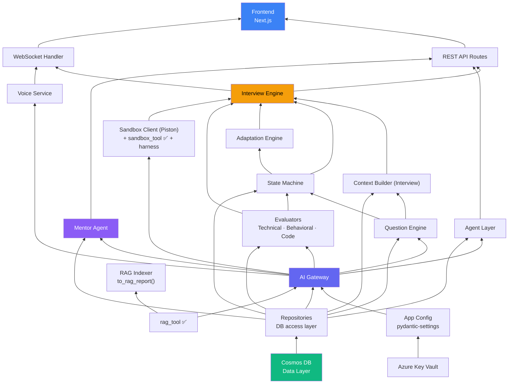

### Build Order (Phase 0 → Phase 1)

Based on the dependency graph, components must be built in this order:

```
1.  Config + Secrets (pydantic-settings + Key Vault): includes PISTON_*, HF_TOKEN, GROQ_*, CHROMA_*
2.  Cosmos DB connection + all Repositories
3.  AI Gateway (stubbed calls initially, token budget hook from day one)
4.  Auth (JWT + user management)
5.  Candidate Profile CRUD
6.  Question bank seed (data/seed → question_bank, incl. sandbox_tool's coding problems)
7.  Context Builder (Interview)
8.  State Machine (+ ACTION_TO_STATE validation table)
9.  Evaluators (Technical first)
10. Adaptation Engine (incl. budget-aware _should_wrap_up)
11. Question Engine (bank first, LLM fallback, focus_topics)
12. Interview Agent (ReAct loop via gateway.generate_with_tools)
13. Interview Engine (wires all above)
14. WebSocket Handler (SESSION_SNAPSHOT on every connect)
15. RAG Indexer: to_rag_report() adapter → rag_tool.index_report()   [rag_tool ✅ built]
16. Mentor Agent: conversation persistence around RagService.answer()  [rag_tool ✅ built]
17. REST API Routes (interview + mentor + code)
18. Coding: sandbox_client + test_harness + sandbox_tool fixes     [sandbox_tool ✅ built, needs fixes]
19. Frontend pages (in parallel with backend from step 7+)
    - Priority order: Dashboard → Interview Config → Interview Session → Report → Mentor
```

---

> **Next document**: `data_models.md` — complete Pydantic model definitions for all request/response schemas and DB documents.
> **See also**: `flow.md` for system flow diagrams, `implementation_plan.md` for the phased execution plan.
