# AI Interview Coach — System Flow Documentation

> **Derived from**: `implementation_plan.md`
> **Purpose**: Defines every user journey, system flow, state machine, and agent workflow in the platform. All engineering decisions should trace back to these flows. When building any feature, refer to the corresponding flow diagram here first.

---

## Table of Contents

1. [Core Product Loop](#1-core-product-loop)
2. [Authentication & Onboarding Flow](#2-authentication--onboarding-flow)
3. [Application Routing Overview](#3-application-routing-overview)
4. [AI Mentor Flow](#4-ai-mentor-flow)
5. [Company Preparation Agent Flow](#5-company-preparation-agent-flow)
6. [Interview Configuration Flow](#6-interview-configuration-flow)
7. [Master Interview State Machine](#7-master-interview-state-machine)
8. [Technical Interview Flow (Text Mode)](#8-technical-interview-flow-text-mode)
9. [Personal / Behavioral Interview Flow](#9-personal--behavioral-interview-flow)
10. [Live Coding Interview Flow](#10-live-coding-interview-flow)
11. [Serious Interview Mode Flow](#11-serious-interview-mode-flow)
12. [Answer Evaluation Pipeline](#12-answer-evaluation-pipeline)
13. [Voice Interview Flow (Phase 5)](#13-voice-interview-flow-phase-5)
14. [Report Generation & Loop Closure](#14-report-generation--loop-closure)
15. [AI Gateway Request Routing](#15-ai-gateway-request-routing)
16. [WebSocket Communication Protocol](#16-websocket-communication-protocol)

---

## 1. Core Product Loop

The heartbeat of the entire platform. Everything in the system exists to power this cycle.

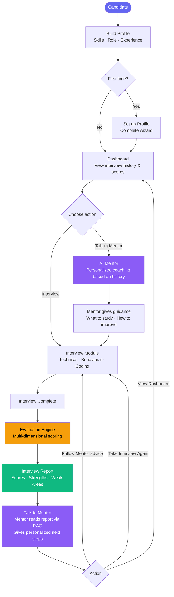

---

## 2. Authentication & Onboarding Flow

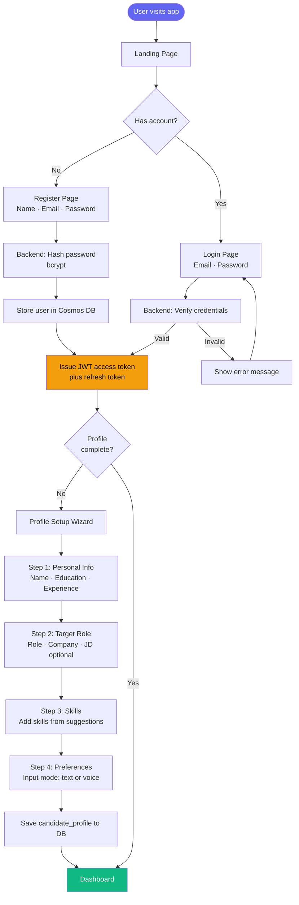

---

## 3. Application Routing Overview

High-level page map and route access rules.

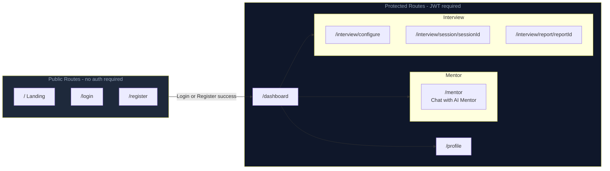

---

## 4. AI Mentor Flow

> **Prototype-first**. The Mentor is the replacement for the entire preparation module. Instead of topic-by-topic learning, the candidate talks to an AI Mentor that knows their full interview history. The Mentor uses **RAG** (Retrieval Augmented Generation) to retrieve past interview reports, evaluation results, and performance data, then gives genuinely personalized coaching.

### 4a. Mentor — Core Chat Flow (Prototype)

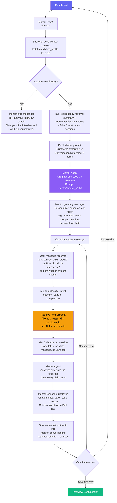

### 4b. RAG Pipeline — What Gets Indexed

Implemented by the built **`rag_tool`** module (`backend/app/core/mentor/rag_tool/`).

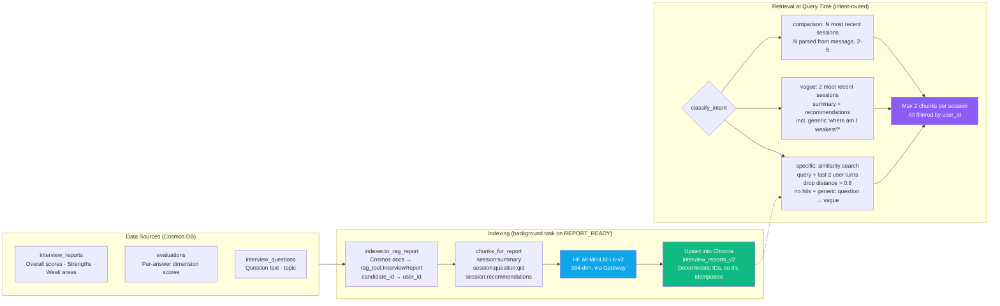

Generic self-assessment questions ("Where am I weakest?", "What should I practise next?") name no topic, so their embeddings sit just past the 0.8 cutoff (measured 0.81–0.84). `is_generic_self_assessment()` routes them to the vague path. It uses a full-string match, so "What are my weaknesses in SQL?" still goes through similarity. Mid-conversation they stay `specific` but fall back to recency when similarity finds nothing. Off-topic questions ("How's my cooking skill?") still get the no-data reply.

Citations: the answer cites excerpts as `[1]`, `[2]`… (full-width `【n】` is normalised to ASCII). `sources[i].citation == i+1` maps each citation to `{session_id, date, topic, chunk_type}`.

### 4c. What the Mentor Can Help With (Prototype Scope)

| Candidate Message | Mentor Capability |
|---|---|
| "What should I study?" | Retrieves weak areas from past reports, gives priority list |
| "How did I do overall?" | Summarizes performance trends across sessions |
| "I struggle with DSA" | Retrieves DSA-specific evaluation chunks, gives targeted advice |
| "Should I take another interview?" | Recommends based on readiness signals from reports |
| "What were my mistakes?" | Retrieves specific evaluation weaknesses with context |
| "Prepare me for Google" | Triggers Company Prep Agent workflow (Section 5) |
| "Compare my last two interviews" | Comparison mode: summary + recommendations of the N most recent sessions |
| "Drill me on my weak spots" | Returns a Weak-Area Drill link to `/interview/configure?topics=…` |
| Off-topic, or "solve this for me" | Declines and redirects to interview feedback (guardrail in the Mentor prompt) |

> [!NOTE]
> **Prototype boundary**: For the prototype, the Mentor is a RAG-powered chat. Advanced capabilities (Mentor-assigned practice tasks, structured study plans, follow-through tracking) are post-prototype enhancements.

---

## 5. Company Preparation Agent Flow

The Company Prep Agent is now accessible **through the Mentor**. When a candidate says "Prepare me for Company X", the Mentor triggers this workflow.

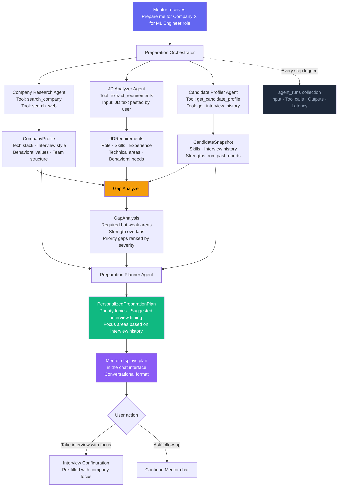

---

## 6. Interview Configuration Flow

Before every interview session, the candidate configures parameters. The backend validates and creates a session.

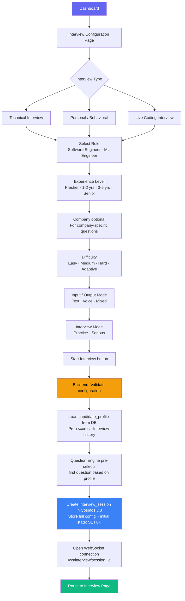

---

## 7. Master Interview State Machine

The single most critical flow in the system. **State lives in Cosmos DB — not in the LLM, not in the WebSocket connection.** Reconnection always resumes from the last persisted state.

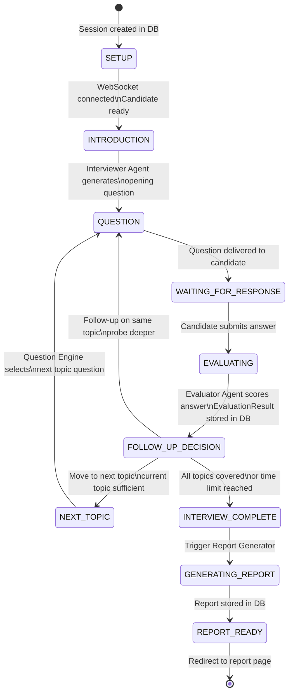

---

## 8. Technical Interview Flow (Text Mode)

Detailed flow for the primary interview type, from first question to adaptive progression.

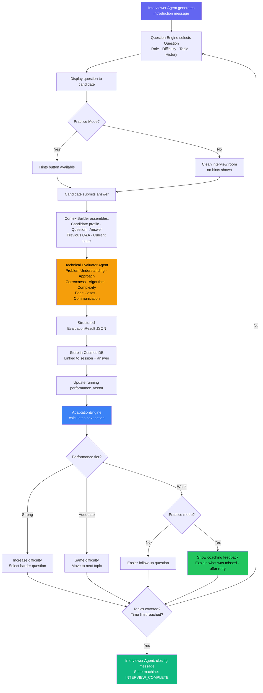

---

## 9. Personal / Behavioral Interview Flow

Behavioral interviews use the STAR framework as the evaluation backbone.

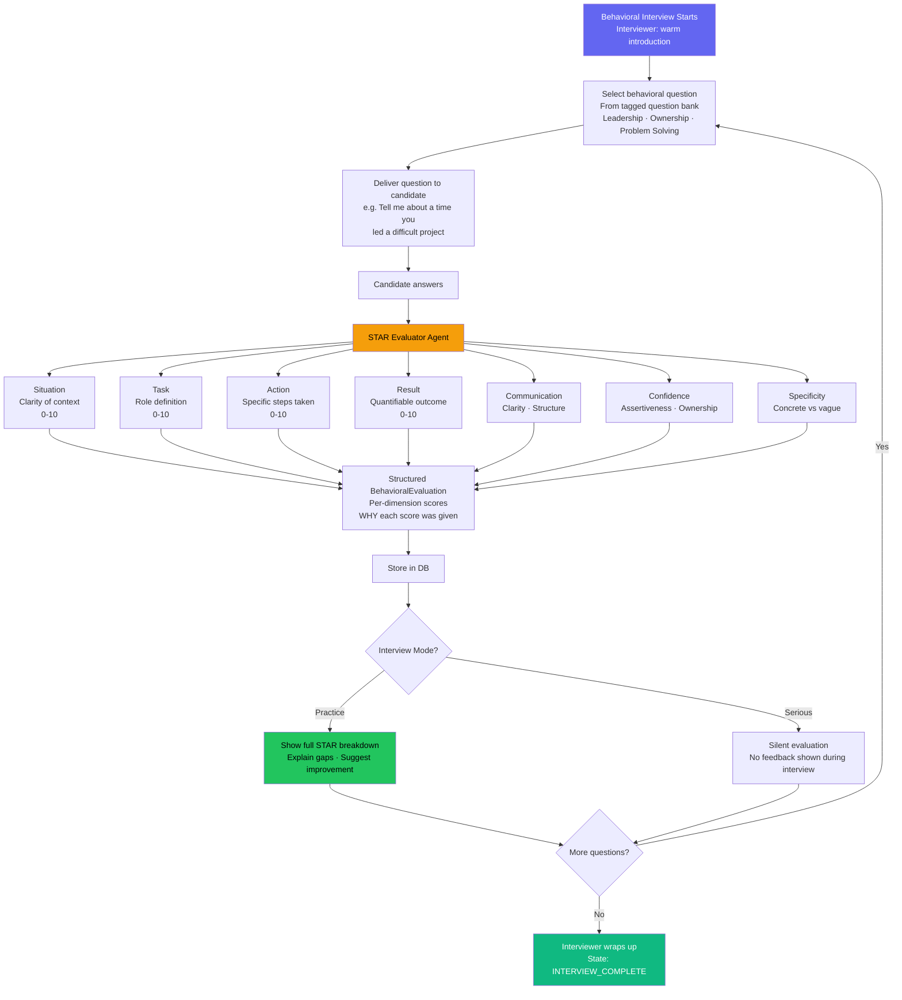

---

## 10. Live Coding Interview Flow

The most technically complex interview type. Combines a real code editor, sandboxed execution, and AI evaluation.

### 10a. High-Level Flow

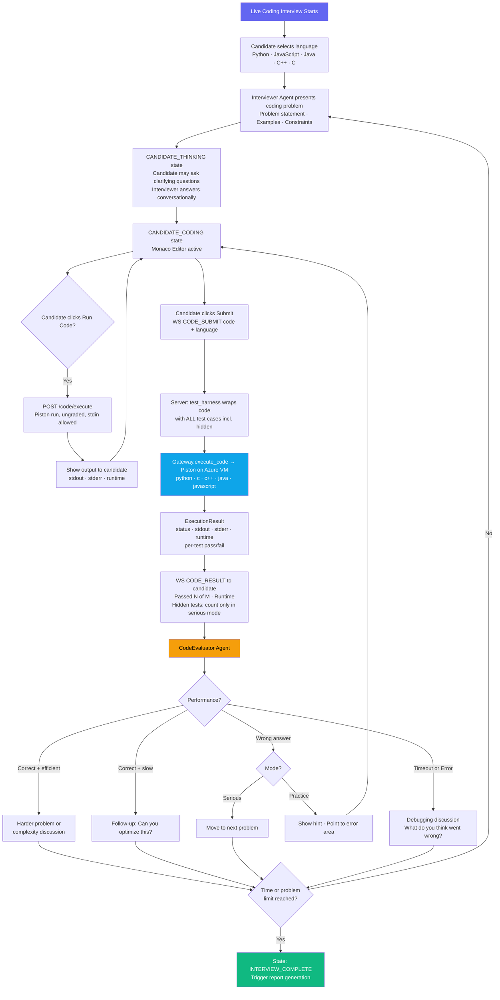

### 10b. Code Execution Sandbox Routing

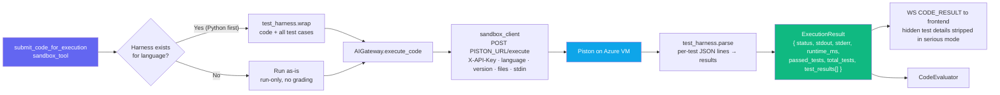

The browser never reports its own execution result. Grading is based only on the harness's per-test output, never on the exit code.

### 10c. Live Coding State Sub-Flow

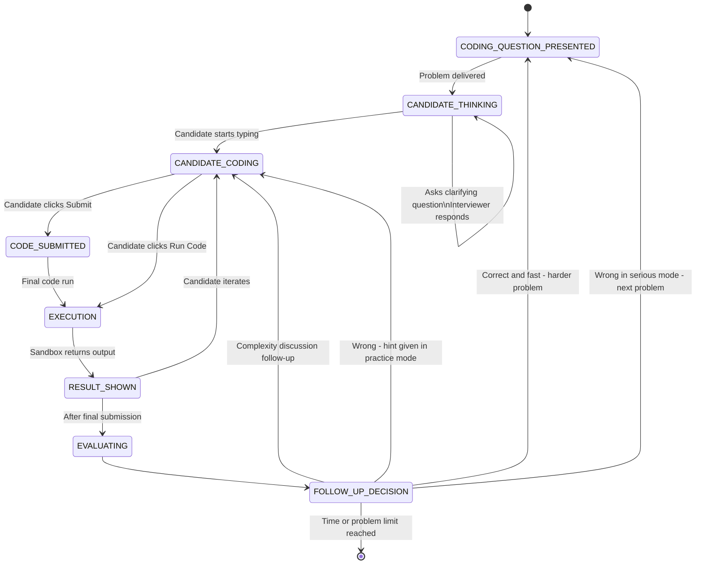

### 10d. CodeEvaluator Dimensions

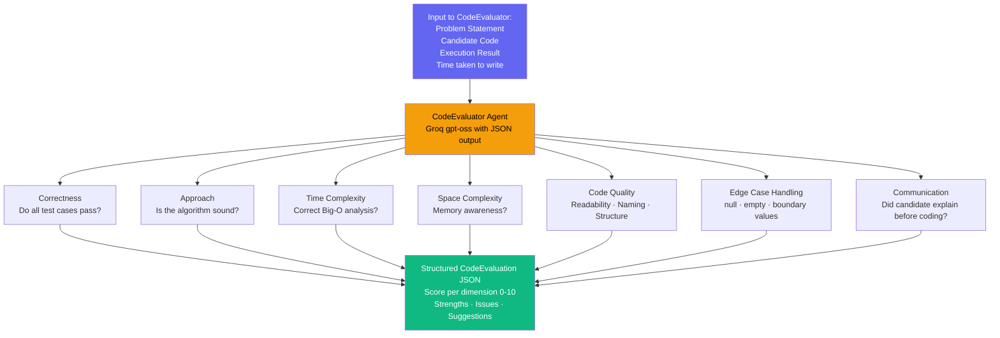

---

## 11. Serious Interview Mode Flow

In Serious mode the Interviewer and Evaluator are **strictly separated**. The Interviewer Agent never sees numeric scores.

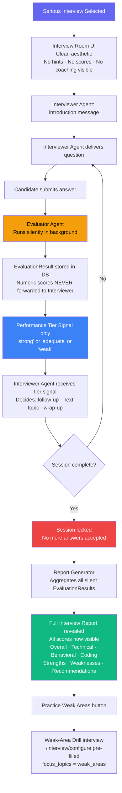

---

## 12. Answer Evaluation Pipeline

How a single candidate answer moves from raw text to a structured, multi-dimensional score.

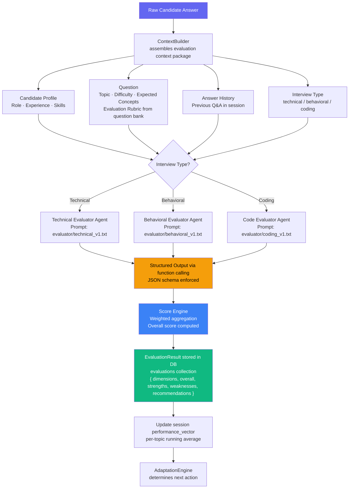

---

## 13. Voice Interview Flow (Phase 5)

Voice is an **adapter** layered on top of the text interview engine. The core engine is completely unchanged.

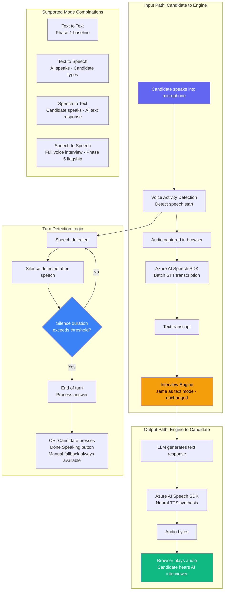

---

## 14. Report Generation & Loop Closure

How an interview result closes the loop: back to the Mentor, and into a targeted drill interview.

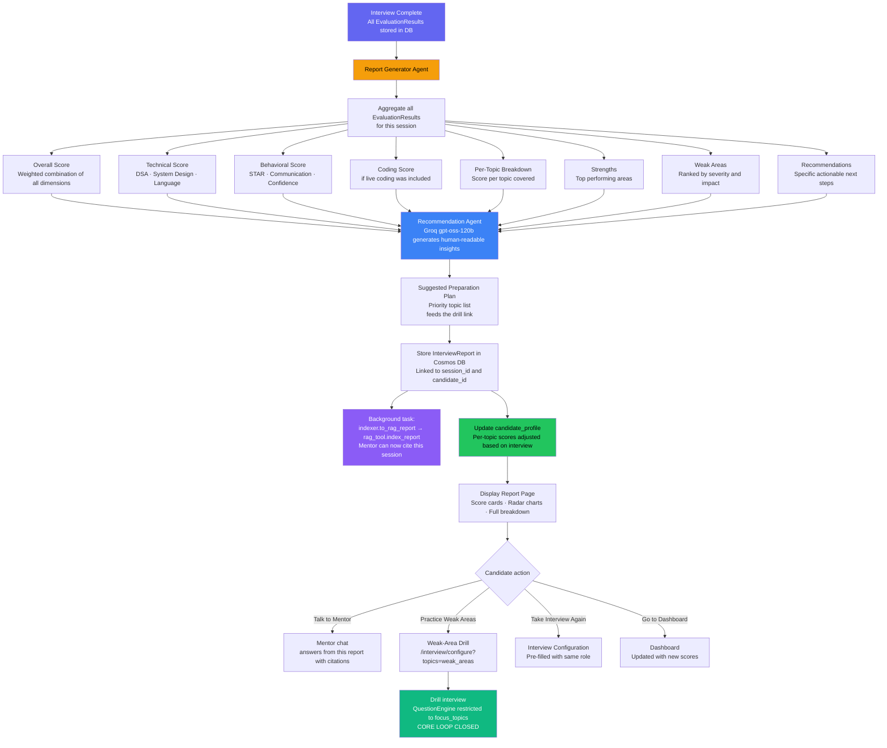

---

## 15. AI Gateway Request Routing

All AI and code-execution calls go through a single internal gateway. **No component calls Azure, Groq, Chroma or Piston directly.**

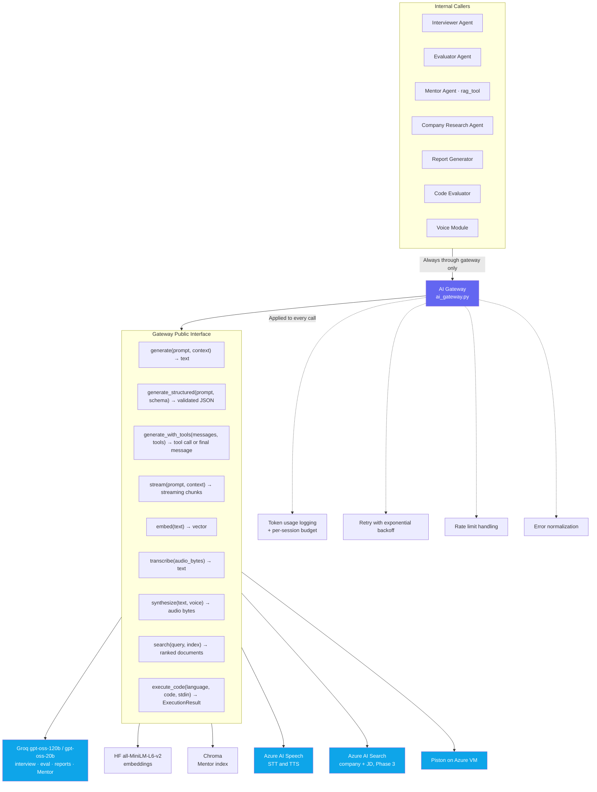

---

## 16. WebSocket Communication Protocol

The real-time channel between the frontend and backend during an active interview session.

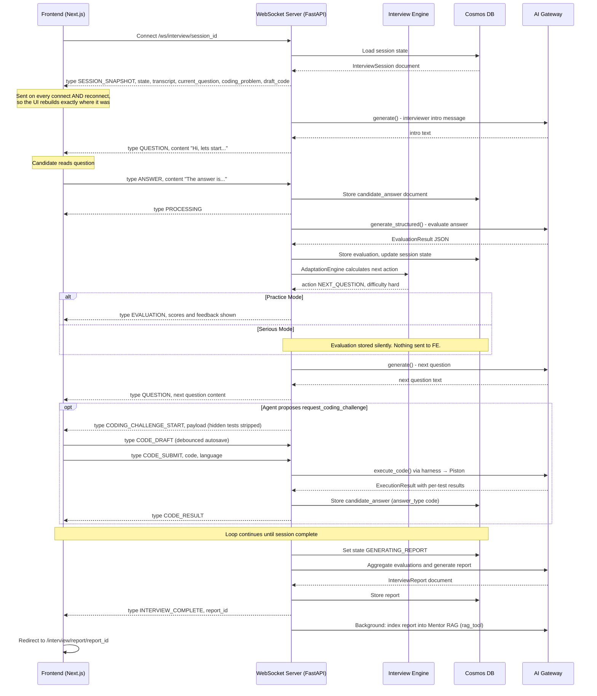

Event names and payloads are defined in `architecture.md` §13 (single source of truth).

### Edge cases

| Situation | Behaviour |
|---|---|
| WebSocket drops mid-question or mid-coding | Reconnect → `SESSION_SNAPSHOT` restores the question, transcript and last autosaved code |
| Piston unreachable or times out | `CODE_RESULT` with status `internal_error` / `time_limit`; the candidate can resubmit, and the interview isn't blocked |
| Candidate skips the coding problem | Recorded as an unanswered coding question; the agent moves on |
| Token budget exceeded | `AdaptationEngine` forces a wrap-up; the interviewer closes normally and the report is generated |
| RAG indexing fails | Report stays in Cosmos; indexing is retried (idempotent upsert). The Mentor just can't cite that session yet |

---

## Flow Relationships Map

How all 16 flows connect to each other across the system.

```mermaid
flowchart LR
    F2[Auth and Onboarding] --> F3[App Routing]
    F3 --> F4[AI Mentor Flow]
    F3 --> F5[Company Prep Agent]
    F3 --> F6[Interview Config]

    F4 --> F5

    F6 --> F7[State Machine]
    F7 --> F8[Technical Interview]
    F7 --> F9[Behavioral Interview]
    F7 --> F10[Live Coding Interview]

    F8 --> F12[Evaluation Pipeline]
    F9 --> F12
    F10 --> F12

    F8 --> F11[Serious Interview Mode]
    F9 --> F11
    F10 --> F11

    F11 --> F12
    F12 --> F14[Report and Loop Closure]
    F14 --> F4

    F13[Voice Flow] -.->|"wraps"| F8
    F13 -.->|"wraps"| F9

    F15[AI Gateway] -.->|"used by"| F8
    F15 -.->|"used by"| F9
    F15 -.->|"used by"| F10
    F15 -.->|"used by"| F5
    F15 -.->|"used by"| F4

    F16[WebSocket Protocol] -.->|"transport for"| F7

    style F14 fill:#10b981,color:#fff
    style F15 fill:#f59e0b,color:#000
    style F12 fill:#3b82f6,color:#fff
    style F4 fill:#8b5cf6,color:#fff
```

---

> **Next document**: `architecture.md` — component-level system architecture, data model relationships, and Azure service mapping.
