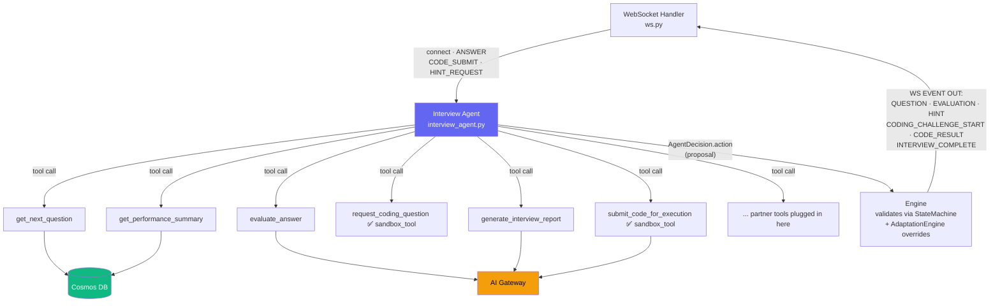
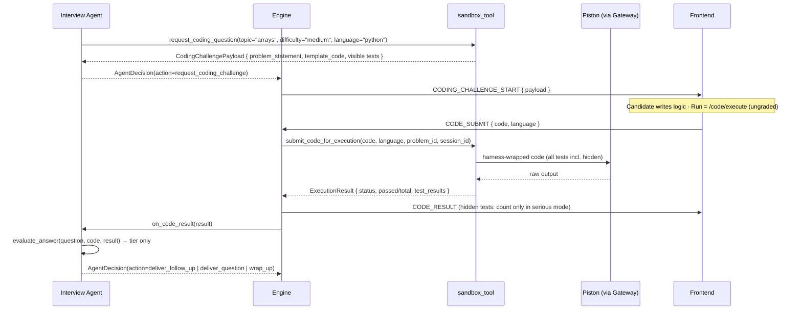

# Interview Agent — Implementation Plan

The Interview Agent is the central intelligence that conducts live interview sessions. It is an **agentic LLM loop** that drives the entire conversation: generating questions, listening to responses, evaluating them, and deciding what comes next — all while coordinating with other services (question bank, evaluators, coding sandbox) via a clean tool-call interface. This makes it straightforward to plug in new capabilities developed by other team members as tools.

---

## System Position

The Interview Agent sits **inside the Interview Engine** (`app/core/interview/engine.py`), replacing the ad-hoc sequencing of individual LLM calls with a single, structured agent loop. Every event that arrives on the WebSocket is routed to this agent. The agent decides what action to take and emits typed events back to the frontend.



---

## Design Principles

1. **Agent = tool orchestrator, not a monolith.** The agent holds the conversation context and decides *what* to do. Each *action* is a named tool. This keeps the agent prompt stable and makes individual capabilities easy to replace or extend.

2. **State lives in Cosmos DB, not in the agent.** On every significant state change, the StateMachine writes to DB. If the WebSocket drops, re-connecting rebuilds the agent context from DB — no lost progress.

3. **Interviewer ≠ Evaluator.** The agent that conducts the conversation (the Interviewer role) never receives numeric scores. It only receives a performance tier (`strong | adequate | weak`) from the evaluation tool. This preserves the Serious Mode guarantee.

4. **Tool interface = integration boundary.** Tools that haven't been built yet are declared as stubs with the correct signature. When a partner finishes their module, they implement the stub — the agent's prompt and loop logic don't change. *(The coding tools have already landed this way: `backend/app/core/coding/sandbox_tool/`.)*

6. **The agent proposes, the engine decides.** The agent returns an `action`, never a state. The engine maps it to a state, validates it with `StateMachine.can_transition()`, and `AdaptationEngine._should_wrap_up()` can overrule it (time, question count, token budget). This keeps principle 1 of `architecture.md` intact.

5. **Structured outputs, always.** Every agent reasoning step that produces a decision emits a validated Pydantic object. No string parsing of agent responses.

---

## Agent Architecture

### Agent Loop

```
while session is ACTIVE:
    event = await websocket.receive()

    match event.type:                       # wire names: architecture.md §13
        (connect)     → send SESSION_SNAPSHOT; if state == SETUP: agent.on_session_start(session, profile)
        ANSWER        → agent.on_answer_received(answer, session)
        CODE_SUBMIT   → result = await submit_code_for_execution(...)   # server executes, never the client
                        send CODE_RESULT(result); agent.on_code_result(result, session)
        CODE_DRAFT    → persist draft_code (no agent call)
        HINT_REQUEST  → agent.on_hint_requested(session)                 # practice mode only
```

Each handler triggers the agentic reasoning loop:

```
1. Assemble context (session state, conversation history, candidate profile)
2. Call LLM with context + available tools
3. LLM returns: { thought, tool_name, tool_args }  OR  { thought, message_to_candidate }
4. If tool call → execute tool → append result to context → repeat from step 2
5. If final message → return AgentDecision(action, message) to the engine
6. Engine validates action → applies transition (or override) → emits WebSocket event → persists state
```

The LLM call is `AIGateway.generate_with_tools()` (hand-rolled ReAct on Groq tool calling; see Q1). Token usage counts against the session budget.

---

## File Plan

### New Files

#### [NEW] `app/agents/interview_agent.py`

The main agent class. Owns the agentic loop, tool registry, context assembly, and WebSocket event emission.

```python
class InterviewAgent:

    def __init__(self, gateway: AIGateway, db: Database, session: InterviewSession, profile: CandidateProfile):
        self.gateway = gateway
        self.db = db
        self.session = session
        self.profile = profile
        self.tools = self._register_tools()          # dict[str, Callable]
        self.conversation_history: list[Message] = []

    # ── Entry points (called by WebSocket handler) ────────────────────────────

    async def on_session_start(self) -> AgentEvent:
        """Generate opening intro, select and deliver first question."""

    async def on_answer_received(self, answer: str) -> AgentEvent:
        """Evaluate answer, decide follow-up/next-topic/complete, deliver next action."""

    async def on_hint_requested(self) -> AgentEvent:
        """Practice mode only: generate contextual hint for current question."""

    async def on_code_result(self, result: CodeExecutionResult) -> AgentDecision:
        """Called after the SERVER executed a CODE_SUBMIT (never with a client-reported result).
        Calls evaluate_answer with the code + result, then proposes the next action."""

    # ── Agentic loop ──────────────────────────────────────────────────────────

    async def _run_loop(self, trigger_message: str) -> AgentDecision:
        """
        Core ReAct-style loop:
        Thought → Tool Call → Observation → ... → Final Response
        Max iterations: 6 (prevents runaway loops)
        """

    # ── Tool registry ─────────────────────────────────────────────────────────

    def _register_tools(self) -> dict[str, Tool]:
        """
        Returns all available tools.
        Stub tools (not yet implemented) are registered with is_available=False
        so the LLM cannot call them until they're wired up.
        """
```

---

#### [NEW] `app/agents/interview_tools.py`

All tool functions the agent can call. Implemented tools are fully functional; future tools are stubs with clear signatures and docstrings.

```python
# ── Implemented Tools ─────────────────────────────────────────────────────────

async def get_next_question(
    session: InterviewSession,
    profile: CandidateProfile,
    difficulty_delta: int,          # -1 | 0 | +1 from adaptation engine
    db: Database,
    gateway: AIGateway
) -> QuestionPayload:
    """
    Selects the next question.
    Priority: question bank match → LLM generation fallback.
    Marks question as asked in session (asked_question_ids).
    Returns: { question_id, question_text, topic, difficulty, expected_concepts }
    """

async def evaluate_answer(
    question: QuestionPayload,
    answer_text: str,
    session: InterviewSession,
    profile: CandidateProfile,
    gateway: AIGateway,
    db: Database
) -> EvaluationSummary:
    """
    Routes to TechnicalEvaluator, BehavioralEvaluator, or CodeEvaluator
    based on interview_type.
    Stores full EvaluationResult in DB.
    Returns to agent: { performance_tier, strengths[], weaknesses[], coaching_note }
    NOTE: numeric scores are NEVER returned to the agent — only the tier signal.
    """

async def get_performance_summary(
    session_id: str,
    db: Database
) -> PerformanceSummary:
    """
    Reads performance_vector from session in DB.
    Returns: { topics_covered, weak_topics, overall_tier, questions_asked }
    Used by agent to decide when to wrap up or shift topics.
    """

async def generate_interview_report(
    session_id: str,
    gateway: AIGateway,
    db: Database
) -> ReportPayload:
    """
    Aggregates all EvaluationResults for the session.
    Calls LLM to generate human-readable insights.
    Stores InterviewReport in DB.
    Returns: { report_id }
    """


# ── Coding tools: ✅ implemented in app/core/coding/sandbox_tool/ ─────────────

from app.core.coding.sandbox_tool.coding_tools import (
    request_coding_question,     # (topic, difficulty, language, session, db, gateway, serious_mode) -> CodingChallengePayload
    submit_code_for_execution,   # (code, language, problem_id, session_id) -> CodeExecutionResult
)

# Contract kept by sandbox_tool (see docs/modules/coding-sandbox.md):
#   request_coding_question -> selects a problem (question_bank, for_coding_interview=True),
#       pre-fills template_code for the language, strips hidden tests from the payload in serious mode.
#   submit_code_for_execution -> runs the code SERVER-SIDE through test_harness + gateway.execute_code()
#       (Piston) against ALL test cases, and returns per-test results.
#
# Phase 4 fixes before is_available=True (plan-review.md §C): graded harness (C1), no Flask
# server or global state (C2), Piston only via the gateway (C3), Go removed and C added (C4),
# problems from question_bank (C5).
```

---

#### [NEW] `app/agents/interview_agent_schemas.py`

All Pydantic schemas used by the agent. Single source of truth for all typed inputs/outputs.

```python
class AgentDecision(BaseModel):
    """The structured output of one agent reasoning step."""
    action: Literal["deliver_question", "deliver_follow_up", "request_coding_challenge",
                    "deliver_feedback", "wrap_up", "deliver_hint"]
    message_to_candidate: str           # The interviewer's spoken/written response
    tool_used: str | None               # Which tool was called to inform this decision
    # No next_state: the engine maps action -> state via ACTION_TO_STATE and validates it
    # with StateMachine.can_transition(); AdaptationEngine._should_wrap_up() can overrule it.

class QuestionPayload(BaseModel):
    question_id: str
    question_text: str
    topic: str
    difficulty: Literal["easy", "medium", "hard"]
    expected_concepts: list[str]
    is_coding_question: bool = False

class EvaluationSummary(BaseModel):
    """What the Interviewer Agent is allowed to see from an evaluation."""
    performance_tier: Literal["strong", "adequate", "weak"]
    strengths: list[str]
    weaknesses: list[str]
    coaching_note: str                  # In practice mode only: explanation for candidate
    # numeric scores are in the DB but never surfaced here

class CodingChallengePayload(BaseModel):
    problem_id: str
    problem_statement: str
    examples: list[dict]
    constraints: str
    template_code: str
    language: str
    test_cases: list[dict]             # hidden tests stripped from the client payload in serious mode
    time_limit_minutes: int
    starter_code: dict[str, str]       # per-language starters (python, c, cpp, java, javascript)

# Canonical execution status enum (shared with architecture.md §10.4):
ExecutionStatus = Literal["accepted", "wrong_answer", "time_limit",
                          "runtime_error", "compile_error", "internal_error"]

class AgentEvent(BaseModel):
    """Typed WebSocket event emitted back to the frontend."""
    type: Literal[
        "SESSION_SNAPSHOT", "QUESTION", "EVALUATION", "HINT",
        "CODING_CHALLENGE_START", "CODE_RESULT", "INTERVIEW_COMPLETE", "PROCESSING", "ERROR"
    ]                                  # must match architecture.md §13
    content: str | None
    payload: dict | None               # structured data (e.g., coding challenge details)
    session_state: str                 # current state machine state
```

---

#### [NEW] `prompts/interviewer/interviewer_v1.txt`

The system prompt for the Interviewer Agent role. Defines the persona, behavioral rules, and tool usage instructions.

Key sections:
- **Persona**: Professional but warm technical interviewer
- **Behavior rules**: 
  - Never reveal numeric scores (you only receive tier signals)
  - In Serious mode: don't comment on performance quality during the interview
  - In Practice mode: give encouraging, specific coaching feedback
  - Ask only one question at a time
  - Don't give away answers through leading questions
- **Coding tool trigger rules**:
  - Use `request_coding_question` when: interview_type is `coding`, OR agent decides a DSA question is better demonstrated in code
  - Always generate template code with the function signature and docstring filled in
  - The candidate only needs to implement the logic body
- **Tool usage format** (for structured parsing)
- **Wrap-up criteria**: when to decide the interview is complete

---

### Modified Files

#### [MODIFY] `app/core/interview/engine.py`

The engine becomes a thin **coordinator**: it instantiates the `InterviewAgent`, routes WebSocket events to it, **validates** the agent's proposed action, and emits the resulting event.

**What changes:**
- Remove the manual call chain (`select_next_question → evaluate → adapt → next_question`)
- Add: `agent = InterviewAgent(gateway, db, session, profile)`
- Add: Route incoming WS events to the correct agent handler
- Add: `ACTION_TO_STATE` table + `StateMachine.can_transition()` check on every `AgentDecision`. An invalid action is re-prompted once, then falls back to `AdaptationEngine.decide_next_action()`.
- Add: override: if `AdaptationEngine._should_wrap_up(session, gateway.budget_remaining(session_id))` is true, the transition is `INTERVIEW_COMPLETE` regardless of the proposal

**What stays unchanged:**
- `StateMachine` — owns transitions (now fed by validated agent actions)
- `ContextBuilder` — still called inside tool implementations
- `AdaptationEngine` — still called inside `evaluate_answer` tool, plus the wrap-up override
- All DB repositories — unchanged

#### [MODIFY] `app/api/v1/ws.py`

- On every connect/reconnect: send `SESSION_SNAPSHOT`.
- Inbound `CODE_SUBMIT { code, language, is_final }`: the **server** calls `submit_code_for_execution()`, sends `CODE_RESULT`, then calls `agent.on_code_result(result)`. There is no client-reported result event.
- Inbound `CODE_DRAFT`: persist `current_coding_problem.draft_code` (debounced by the client).
- Event names and payloads: `architecture.md` §13.

---

## Tool Integration Contract (For Partner Teams)

When another team member builds a new capability and wants to plug it in as an agent tool, they must:

1. **Implement the stub** in `interview_tools.py` (remove the `raise NotImplementedError`, add real logic)
2. **Match the declared return type** exactly — the agent's prompt and parsing logic depend on the schema
3. **Register the tool** in `InterviewAgent._register_tools()` by setting `is_available=True`
4. **Add a prompt note** in `interviewer_v1.txt` explaining when the LLM should prefer this tool

For the **coding module specifically** (`request_coding_question` + `submit_code_for_execution`):
- The tool must return `CodingChallengePayload` with `template_code` pre-filled (function signature, docstring, and any helper code the agent wants to scaffold)
- The agent sets up the template; the candidate only writes the logic body
- Test case visibility: hidden in Serious mode, visible in Practice mode

---

## Agent Prompt Strategy

The agent uses a **ReAct-style prompt** (Reason + Act):

```
System: [Interviewer persona + behavioral rules + tool definitions]

Context block (assembled fresh each loop iteration):
  - Candidate: {name, role, experience_level}
  - Interview type: {technical | behavioral | coding}
  - Interview mode: {practice | serious}
  - Topics covered so far: [...]
  - Questions asked: N
  - Last performance tier: {strong | adequate | weak}   ← never a score
  - Conversation history: [last 8 turns]

User turn: [triggering event description]

→ Agent reasons about what to do next
→ Agent emits: tool_call OR final_message
```

The context block is built by `ContextBuilder.build_interviewer_context()` (already defined in architecture). The agent never sees past evaluation documents directly — it only sees what the `evaluate_answer` tool returns.

---

## Coding Challenge Flow

The coding tools are implemented (`sandbox_tool`). They're registered with `is_available=True` once the Phase 4 fixes land. Until then the engine catches the unavailable tool and falls back to a verbal DSA question.

1. Agent calls `request_coding_question(topic, difficulty, language, session, serious_mode)`
2. Tool returns `CodingChallengePayload` with template code pre-filled (hidden tests stripped from the payload)
3. Engine stores `current_coding_problem` on the session and emits `CODING_CHALLENGE_START`
4. Frontend opens Monaco with the template. **Run** → `POST /api/v1/code/execute` (ungraded); edits autosave via `CODE_DRAFT`
5. **Submit** → `CODE_SUBMIT { code, language }`
6. Server runs `submit_code_for_execution` → test harness → `gateway.execute_code()` → Piston, against **all** test cases
7. Engine emits `CODE_RESULT` and calls `agent.on_code_result(result)`
8. Agent calls `evaluate_answer` with the code + result (CodeEvaluator), and proposes the next action



---

## State Machine Integration

The agent does **not** own the state machine. It returns an `action`; the engine looks the action up in `ACTION_TO_STATE`, checks it with `StateMachine.can_transition()`, applies any `AdaptationEngine` override, then calls `StateMachine.transition()`.

| Agent Action | State Transition (applied by the engine) |
|---|---|
| Deliver first question | `INTRODUCTION → QUESTION` |
| Question sent to candidate | `QUESTION → WAITING_FOR_RESPONSE` |
| Start evaluating answer | `WAITING_FOR_RESPONSE → EVALUATING` |
| Decide follow-up needed | `EVALUATING → FOLLOW_UP_DECISION → QUESTION` |
| Move to next topic | `EVALUATING → FOLLOW_UP_DECISION → NEXT_TOPIC → QUESTION` |
| Start coding challenge | `QUESTION → WAITING_FOR_RESPONSE` (coding sub-state) |
| All topics done | `EVALUATING → FOLLOW_UP_DECISION → INTERVIEW_COMPLETE` |
| Report generated | `INTERVIEW_COMPLETE → GENERATING_REPORT → REPORT_READY` |

---

## Open Questions

> [!IMPORTANT]
> **Q1 — LLM Framework** ✅ **Resolved**: hand-rolled ReAct loop via `AIGateway.generate_with_tools()`.
>
> **Reasoning**: Hand-rolled using Groq's native `tools` parameter (`openai/gpt-oss-120b`). Avoids framework overhead, stays consistent with the existing AI Gateway pattern, and gives full control over retry logic and prompt versioning.

> [!IMPORTANT]
> **Q2 — Agent granularity**: Should the Interviewer Agent and the Evaluator be the same agent instance (different tool calls) or separate agent classes?
>
> **Recommendation**: Keep them as separate concerns. The `evaluate_answer` *tool* internally delegates to the existing `TechnicalEvaluator`/`BehavioralEvaluator` classes — those are unchanged. The Interviewer Agent never instantiates an evaluator directly.

> [!NOTE]
> **Q3 — Practice mode coaching**: In practice mode, after evaluation, should the agent generate its coaching feedback in the same agentic loop turn (using the `coaching_note` from the evaluation tool), or make a separate LLM call for a richer explanation?
>
> **Recommendation**: Use the `coaching_note` from the evaluation tool for now. A richer dedicated coaching call can be added as another tool later.

> [!NOTE]
> **Q4 — Max questions / time limit**: Where should the wrap-up threshold live — in the agent's prompt, in the `get_performance_summary` tool, or in the `AdaptationEngine`?
>
> **Recommendation**: The `get_performance_summary` tool returns `{ questions_asked, weak_topics, overall_tier }` and also a boolean `should_wrap_up` computed by `AdaptationEngine._should_wrap_up()`. The agent's prompt instructs it to respect this signal.

---

## Verification Plan

### Automated Tests
- `pytest tests/agents/test_interview_agent.py` — unit tests for the agentic loop with mocked tool responses
- `pytest tests/agents/test_interview_tools.py` — unit tests for each tool function in isolation
- `pytest tests/core/test_state_machine.py` — existing state machine tests should still pass unchanged

### Manual Verification
1. Start a Technical interview session → verify opening question is delivered
2. Submit an answer → verify evaluation fires, performance tier is returned, next question adapts
3. Complete a full session → verify report is generated and stored
4. Test Serious mode: verify no scores appear in WS events during the session
5. Test Practice mode: verify coaching feedback appears after each answer
6. Verify WebSocket reconnect mid-session resumes from correct state (kill and reconnect)
7. With the coding tools unavailable → verify graceful fallback to a verbal DSA question (no crash)
8. With the coding tools available → submit a solution with its asserts deleted; the harness still grades it correctly, and hidden test inputs never reach the client in Serious mode
9. Force an invalid agent action (e.g. `wrap_up` on question 1 with the budget remaining) → the engine rejects it and falls back to `AdaptationEngine`
